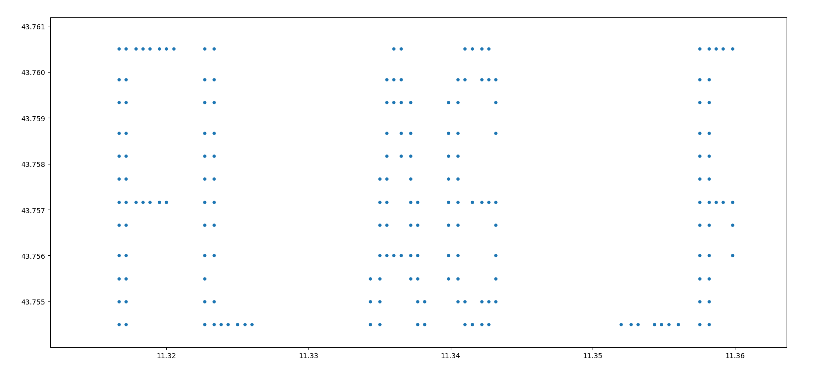

# DanteCTF 2023 Writeup (Team: L3ak, 4th Place)
Competition URL: https://dantectf.it/
## Overview

| Challenge | Category | Points | Flag |
| --------- | -------- | ------ | ---- |
| PiedPic | Crypto | 435 | DANTE{Att4cks_t0_p1x3L_Encrypt3d_piCtUrES_511f0c49f8be} |
| Almost Perfect Remote Signing | Forensics | 463 | DANTE{FLAG_REPORTING_SYSTEM} |
| StrangeBytes | Misc | 490 | DANTE{AHh9HhH0hH_ThAat_RAnsomware_maDe_m3_SaD_FFFFAAABBBBDDDD67} |

## 1) PiedPic
In this crypto challenge, we are given a Python file named ```PiedPic.py``` which takes an image as input and encrypts it. It also encrypts a "flag file" that we presumably must decrypt. The ```encrypt_image``` function is shown below.
```Python
def encrypt_image(image, key):
    perm_table = {0: (0, 1, 2), 1: (0, 2, 1), 2: (1, 0, 2), 3: (1, 2, 0), 4: (2, 0, 1), 5: (2, 1, 0)}
    size = image.size[0] * image.size[1]
    assert(size == len(key))
    pixels = list(image.getdata())

    for i in range(len(pixels)):
        p = pixels[i]
        kbyte = key[i]
        
        color = [p[i]^255 if kbyte & (1 << i) else p[i] for i in range(3)]  
        (r,g,b) = perm_table[int(kbyte) % 6]
        pixels[i] = (color[r], color[g], color[b])
 
    image.putdata(pixels)
    bs = BytesIO()
    image.save(bs, format=flag_file[-3:])

    return b64encode(bs.getvalue())
```
A close inspection will reveal that each RGB pixel in the image is encrypted using a permutation-substitution transformation according to the bits of the key. First, the R/G/B values are negated ```(p[i]^255)``` if the 1st/2nd/3rd least significant bits in the key are set - this is the substitution step. Next, the RGB values are swapped around according to positions specified in the ```perm_table``` based upon the remainder of ```key_byte % 6``` - this is the permutation step. The new RGB values are written back into the pixel and the process repeats for all pixels in the image. Finally, the resulting bytes are encoded in base64 and sent to the user.

To decrypt the image, we need to reverse the above process, and we also need to recover the key. We are allowed to give the program one image to encrypt for us with the _same key_ as the flag image. Therefore, we need to cleverly choose the RGB values of our test image so that we can know by looking at the encrypted version (1) which permutation was used and (2) which values were flipped. This will allow us to reconstruct the key byte (```kbyte```) to ultimately decrypt the flag image.

The method I devised to accomplish this task is to use (1,2,4) for the (R,G,B) values in every image pixel. Why use these numbers? Well, the binary equivalent of (1,2,4) is (001, 010, 100), and the negated version of this is (110, 101, 011). Thus, for any combination of substitutions and permutations, we can find the permutation and substitution by the mapping between the original and encrypted forms.

For example, if the first byte (the "R" in RGB) is negated in the substitution step, then (1,2,4) becomes (254,2,4). Then, if the permutation chosen by the key is (0,2,1) then (254,2,4) becomes (254,4,2) (i.e., the 2nd and 3rd values are swapped). Looking at the encrypted version, we know that 254 has to correspond to 1 (reversing the substitution step) and that the 2nd and 3rd values are swapped (since we know the original order). Thus we can also reverse the permutation. Once that is done, we can reverse engineer the key byte used for the current pixel. Repeating this process for all pixels will uncover the entire keystream which we can use to decrypt the flag.

**Python Solution:**
```Python
import time
from pwn import *
from PIL import Image
from io import BytesIO
from base64 import b64encode, b64decode
from Crypto.Random import get_random_bytes

def encrypt_image(image, key):
    perm_table = {0: (0, 1, 2), 1: (0, 2, 1), 2: (1, 0, 2), 3: (1, 2, 0), 4: (2, 0, 1), 5: (2, 1, 0)}
    size = image.size[0] * image.size[1]
    assert(size == len(key))
    pixels = list(image.getdata())

    for i in range(len(pixels)):
        p = pixels[i]
        kbyte = key[i]
        
        color = [p[i]^255 if kbyte & (1 << i) else p[i] for i in range(3)]  
        (r,g,b) = perm_table[int(kbyte) % 6]
        pixels[i] = (color[r], color[g], color[b])
 
    image.putdata(pixels)
    bs = BytesIO()
    image.save(bs, format=flag_file[-3:])

    return b64encode(bs.getvalue())

def get_key_by_value(dictionary, value):
    for key, val in dictionary.items():
        if val == value:
            return key
    return None  # Value not found

p = remote('challs.dantectf.it', 31511)
sl = 0.2 #Sleep time

while True:
    
    # Get the initial lines
    line = p.recvline()
    if len(line) < 1000:
        print(line.decode('utf-8').rstrip())

    # Say yes
    if 'yours' in line.decode('utf-8').rstrip():
        time.sleep(2)
        p.sendline(b'y')
        time.sleep(2)
        line = p.recvline().decode('utf-8')
        line = p.recvline().decode('utf-8')

    if len(line) > 1000:
        
        # Read in the encrypted flag image and get its size
        line = line.decode('utf-8').rstrip().encode()
        encrypted_bytes = b64decode(line)
        bs = BytesIO(encrypted_bytes)
        flag = Image.open(bs, formats=['PNG'])

        flag_size = flag.size[0] * flag.size[1]
        print('Flag Size (in pixels): ' + str(flag_size))
        
        # Now create our own custom image to encrypt to reverse engineer the key
        # We will set all (R,G,B) values to (1,2,4) so that we can know which
        # permutation/substitution is used based upon the encrypted image
        t_image = Image.new(mode='RGBA', size=(640, 478))
        t_pixels = t_image.load()

        red_value = 1
        green_value = 2
        blue_value = 4

        for y in range(478):
            for x in range(640):
                t_pixels[x, y] = (red_value, green_value, blue_value)
        
        t_img_enc = b64encode(t_image.tobytes())
        key = get_random_bytes(flag.size[0] * flag.size[1])
        image = Image.frombytes(data=b64decode(t_img_enc), mode=flag.mode, size=flag.size)
        test_size = image.size[0] * image.size[1]

        # Send our crafted image to the server for encryption
        p.sendline(t_img_enc)
        time.sleep(sl)
        line = p.recvline().decode('utf-8').rstrip()
        print(line)
        time.sleep(sl)
        line = p.recvline().decode('utf-8').rstrip()
        print(line)
        time.sleep(sl)
        line = p.recvline().decode('utf-8').rstrip()
        print(line)
        time.sleep(sl)
        line = p.recvline().decode('utf-8').rstrip()
        print(line)
        time.sleep(1)
        line = p.recvline().decode('utf-8').rstrip()
        print(line)

        #Read in the encrypted test image and get its size
        t2_enc_bytes = b64decode(line.encode())
        t2_bs = BytesIO(t2_enc_bytes)
        t2_image = Image.open(t2_bs, formats=['PNG'])
        t2_size = t2_image.size[0] * t2_image.size[1]

        #Now recover the key from the image
        t2_pixels = list(t2_image.getdata())
        perm_table = {0: (0, 1, 2), 1: (0, 2, 1), 2: (1, 0, 2), 3: (1, 2, 0), 4: (2, 0, 1), 5: (2, 1, 0)}
        rev_table = {0: (0, 1, 2), 1: (0, 2, 1), 2: (1, 0, 2), 3: (2, 0, 1), 4: (1, 2, 0), 5: (2, 1, 0)}

        keystream = b''

        #for i in range(20):
        for i in range(len(t2_pixels)):

            #First, reverse the permutation
            (r, g, b, a) = t2_pixels[i]
            tup1 = (r, g, b)
            p1 = p2 = p3 = None
            if r == 1 or r == 254:
                p1 = 0
            elif r == 2 or r == 253:
                p1 = 1
            elif r == 4 or r == 251:
                p1 = 2
            if g == 1 or g == 254:
                p2 = 0
            elif g == 2 or g == 253:
                p2 = 1
            elif g == 4 or g == 251:
                p2 = 2
            if b == 1 or b == 254:
                p3 = 0
            elif b == 2 or b == 253:
                p3 = 1
            elif b == 4 or b == 251:
                p3 = 2
            perm = (p1, p2, p3)
            rem = get_key_by_value(perm_table, perm)
            new_pos = rev_table[rem]
            (r1, g1, b1) = (tup1[new_pos[0]], tup1[new_pos[1]], tup1[new_pos[2]])

            #Second, reverse the substitution
            key_int = 0
            if r1 == 254:
                key_int = key_int | 1
                r1 = r1 ^ 255
            if g1 == 253:
                key_int = key_int | 2
                g1 = g1 ^ 255
            if b1 == 251:
                key_int = key_int | 4
                b1 = b1 ^ 255

            while key_int % 6 != rem:
                key_int += 8

            key_byte = key_int.to_bytes(1, byteorder='big')
            keystream += key_byte
            t2_pixels[i] = (r1, g1, b1, a)
   
        #Now, use the keystream to decrypt the flag image
        flag_pixels = list(flag.getdata())
        for i in range(len(flag_pixels)):

            #First, reverse the permutation using the key
            (r, g, b, a) = flag_pixels[i]
            tup1 = (r, g, b)

            kb = keystream[i]
            new_pos = rev_table[kb % 6]

            (r1, g1, b1) = (tup1[new_pos[0]], tup1[new_pos[1]], tup1[new_pos[2]])

            #Second, reverse the substitution using the key
            if kb & 1:
                r1 = r1 ^ 255
            if kb & 2:
                g1 = g1 ^ 255
            if kb & 4:
                b1 = b1 ^ 255

            flag_pixels[i] = (r1, g1, b1, a)

        #end of while loop
        flag.putdata(flag_pixels)
        flag.save('flag.png', 'PNG')
        break

p.close()

# DANTE{Att4cks_t0_p1x3L_Encrypt3d_piCtUrES_511f0c49f8be}
```

**Flag Image:**


**Flag:** ```DANTE{Att4cks_t0_p1x3L_Encrypt3d_piCtUrES_511f0c49f8be}```

## 2) Almost Perfect Remote Signing
In this challenge, we are given a ```.wav``` file with the flag hidden somewhere inside it. Listening to the file yields nothing but ~8 seconds of what sounds like static noise, so we know the flag is encoded inside the sound data somehow. Running the file through steg tools like **Binwalk** and **WavSteg** doesn't reveal much, and LSB analysis doesn't show any signs of the image being encoded in the bits of the file. At this point, I opened the file in ```Sonic Visualiser``` to see what secrets may be encoded in the spectrogram or frequency information of the sound data. Examining the spectrogram, I saw something interesting:


There is a faint binary signal present in the spectrogram! This discovery led me to think that the flag was encoded in the sound data in binary manner somewhow (using 0's and 1's). Being a novice in the area of digital signal processing, I had to do a significant amount of research to determine how this is achieved - via [AFSK](https://en.wikipedia.org/wiki/Frequency-shift_keying) (Audio Frequency Shift Keying). In this protocol, binary data is modulated onto a continuous analog signal for long-distance transmission (e.g., radio). To decode this manually would be a real hassle, so I looked up tools to automate the process. After trying and failing with tools like **GnuRadio**, I stumbled upon [multimon-ng](https://www.kali.org/tools/multimon-ng/). This tool will demodulate the signal and output the encoded data automatically, as long as it knows the exact protocol being used. There are several AFSK protocols to choose from:


and I ended up choosing AFSK1200 to start with (which turned out to be the right choice!).
This tool requires the ```.wav``` file to be in ```.raw``` format, which can be achieved using sox:

```sox -t wav aprs_out.wav -esigned-integer -b16 -r 22050 -t raw aprs_out.raw```

This command essentially takes the wave file and converts it to ```.raw``` format. Notice the sampling rate of 22050Hz being used here, which is the standard for these types of radio transmissions. Once this is done, we can use **multimon-ng** to decode the signal:

```multimon-ng -t raw -a AFSK1200 aprs_out.raw > flag```

The decoded data in ```flag``` looks like:


We are definitely on the right track - we can see "Hello flag!" in every packet. If we scrutinize the data closely, we can see that there are slightly different coordinates used in each packet transmission:


Is the flag encoded in these coordinates somehow? Plotting these coordinates on a Cartesian coordinate system yields:


It's not pretty, but zooming in around small groups of characters can help us read the flag characters:



**Flag:** ```DANTE{FLAG_REPORTING_SYSTEM}```

**Python Code:**
```Python
import matplotlib.pyplot as plt

f = open('flag', 'r')
lines = f.read().splitlines()
f.close()

lats = []
longs = []

for line in lines:
    if 'AFSK' in line:
        continue
    lat_deg = float(line[1:3])
    lat_min = float(line[3:8])
    long_deg = float(line[11:13])
    long_min = float(line[13:18])
    print('lat_deg: ' + str(lat_deg), ' lat_min: ' + str(lat_min) + ', long_deg: ' + str(long_deg) + ', long_min: ' + str(long_min))
    lat = lat_deg + (lat_min/60.0)
    if lat > 43.764:
        lat -= 0.0065
    long = long_deg + (long_min/60.0)
    longs.append(long)
    lats.append(lat)

plt.scatter(longs, lats, s=14)
plt.show()

# The flag is written in the plot, the spacing is a little wonky and you have to piece it together
# DANTE{FLAG_REPORTING_SYSTEM}
```

## 3) StrangeBytes
In this challenge, we are given 250 binary files with what appears to be random, meaningless data in them. We are told from the challenge description that they were encrypted using AES CBC, and that there may be something _strange_ in them which can be exploited.

The [definition of "strange"](https://www.merriam-webster.com/dictionary/strange) is something that is "different from what is usual, ordinary, or expected". So, we know that there is _something_ strange about bytes in these files, but beyond that we don't have much information. Identifying what *exactly* the strange bytes are is probably the first significant hurdle in solving this challenge.

After expending a long time examining the files for any strange bytes, one of our teammates noticed that each file shares a common contiguous subsequence of bytes:


To be exact, there is a sequence of 53 contiguous bytes present in each of the 250 binary files:

```5cf3c0f06ffb02fea39b6dabde2867209e96863463a4b78b55aa4d88b033811e3aba1b257944afdf4f620b0fe47ba1b85c3a434243```

This is interesting...but now what? Knowing what to do next with these bytes is probably the second hurdle in this challenge. Thinking back to the challenge description, we know that the files were encrypted with AES CBC, so is it possible that these bytes contain the IV and encryption key?

Well, if we try taking out these strange bytes from every file, the length of each file becomes an integer multiple of 16: the AES block size! This finding supports our hypothesis, as this is unlikely to be a coincidence. Now the question becomes, which bytes are the IV and which are the key, and how do we know which AES variant (128, 192, 256) was used? If you look closely at the strange bytes and at the image above, you may notice that the last 5 bytes are ```\:CBC```, which seems to act as some sort of delimiter or marker for the strange bytes. If we remove these 5 bytes we are left with 48 bytes for our key + IV. Logically, if the AES blocksize (and therefore IV) is always 16 bytes long, then the other 32 must be the key size, indicating that AES-256 was used. Knowing the variant of AES used for encryption, it's simply a matter of guessing whether the 48 stranges bytes are ```key+IV``` or ```(IV+key)```. Using first option to decrypt the files yields the true plaintexts:


The contents of most of the files don't make sense, but the fact that they only contain uppercase/lowercase english letters indicates we did the decryption properly. Doing a simple ```grep -rF --text "DANTE" .``` will reveal which file contains the flag:


**Flag:** ```DANTE{AHh9HhH0hH_ThAat_RAnsomware_maDe_m3_SaD_FFFFAAABBBBDDDD67}```

**Solution Code:**
```Python
import os
import binascii as b
from Crypto.Cipher import AES
from Crypto.Util.Padding import pad
from Crypto.Random import get_random_bytes

# Make sure these directories exist in the same directory as this program before running
dir_enc = './encrypted_files/'
dir_dec = './decrypted_files/'

# These bytes are the "strange bytes" referenced in the challenge description
# They are present in every encrypted file, and taking them out yields the true ciphertext
lcs = '5cf3c0f06ffb02fea39b6dabde2867209e96863463a4b78b55aa4d88b033811e3aba1b257944afdf4f620b0fe47ba1b85c3a434243'

# Finds longest common subsequence of bytes between all the files in the ./generated directory
def find_lcs(s1, s2):
    matrix = [["" for x in range(len(s2))] for x in range(len(s1))]
    for i in range(len(s1)):
        for j in range(len(s2)):
            if s1[i] == s2[j]:
                if i == 0 or j == 0:
                    matrix[i][j] = s1[i]
                else:
                    matrix[i][j] = matrix[i-1][j-1] + s1[i]
            else:
                matrix[i][j] = max(matrix[i-1][j], matrix[i][j-1], key=len)
    cs = matrix[-1][-1]
    return len(cs), cs

# Decrypt file using AES-256 CBC
def decrypt_file_AES_256_CBC(filename, key, iv):

    # Open the encrypted file and read the ciphertext from it
    with open(dir_enc + filename, 'rb') as file:
        ciphertext = file.read()

    # Create the AES-256 CBC cipher
    cipher = AES.new(key, AES.MODE_CBC, iv)

    # Decrypt the ciphertext
    decrypted_data = cipher.decrypt(ciphertext)

    # Write the decrypted data to a new file in the ./decrypted_files directory
    decrypted_file_path = dir_dec + filename + '.dec'
    with open(decrypted_file_path, 'wb') as file:
        file.write(decrypted_data)


# Start of program
print('Reading in files...')

# Found this after running the program
lcs = '5cf3c0f06ffb02fea39b6dabde2867209e96863463a4b78b55aa4d88b033811e3aba1b257944afdf4f620b0fe47ba1b85c3a434243'

# Specify the path to the subdirectory
directory = './generated/'

# Get the list of file paths in the directory
file_paths = [os.path.join(directory, file) for file in os.listdir(directory)]

# Convert the contents of each binary file to hex strings
hex_strings = []
for file_path in file_paths:
    with open(file_path, 'rb') as file:
        byte_str = file.read()
        hex_str = b.hexlify(byte_str).decode().zfill(len(byte_str) * 2)
        if lcs not in hex_str:
            print(file_path)
        hex_strings.append(hex_str)
        index = hex_str.find(lcs, 0)

print('--> Done\n')
print('Finding the strange bytes present in each file...')

# Find the longest common subsequence SHARED BETWEEN ALL FILES --> these are the "strange bytes"
lcs = hex_strings[0]
for i in range(1, len(hex_strings)):
    curr_file = hex_strings[i]
    len_lcs, lcs = find_lcs(lcs, curr_file)
strange_bytes = bytes.fromhex(lcs)

print('--> Done\n')
print('Strange bytes (hex): ' + lcs)
print('Strange bytes (bin): ' + str(strange_bytes)) 
print('Length of byte sequence: ' + str(len(lcs)/2) + '\n')
print('Removing strange bytes from each binary file...')

# lcs = '5cf3c0f06ffb02fea39b6dabde2867209e96863463a4b78b55aa4d88b033811e3aba1b257944afdf4f620b0fe47ba1b85c3a434243'
# length = 53 bytes


# Remove the strange bytes (lcs) from every file in ./generated and place the file in ./encrypted_files
for filename in os.listdir(directory):

    file_path = os.path.join(directory, filename) 

    # Open the original file with the strange bytes in it
    f = open(file_path, 'rb')
    f_data = f.read()
    f.close()

    # Remove the strange bytes from the file data
    modified_data = f_data.replace(strange_bytes, b'')

    # Open the new file and write the modified bytes to it
    f = open(dir_enc + filename, 'wb')
    f.write(modified_data)
    f.close()

# Verify that the strange bytes are no longer in the encrypted files and that
# the length of the files is a multiple of 16 for AES CBC decryption
for filename in os.listdir(dir_enc):
    file_path = os.path.join(dir_enc, filename)
    f = open(file_path, 'rb')
    f_data = f.read()
    f.close()
    assert(int(len(f_data)) % 16 == 0)
    assert(lcs not in b.hexlify(f_data).decode().zfill(len(f_data) * 2))

print('--> Done\n')
print('Decrypting files...')

# Extract the IV and key from the strange bytes
key = bytes.fromhex(lcs[0:64])
iv = bytes.fromhex(lcs[64:96])

assert(len(iv) == 16)
assert(len(key) == 32)

# Decrypt every file in the directory using the key and IV from the strange bytes
for filename in os.listdir(dir_enc):

    # Decrypt the file using AES-256 CBC
    decrypt_file_AES_256_CBC(filename, key, iv)

print('--> Done\n')

# If you grep for 'DANTE' in the ./decrypted_files directory, you'll see the flag
# is in decrypted_files/veUIZbPBWvSDVcdL.dec

# Flag: DANTE{AHh9HhH0hH_ThAat_RAnsomware_maDe_m3_SaD_FFFFAAABBBBDDDD67}
```
