# pingCTF 2022 Writeup (3rd Place)
Competition URL: https://ctf.knping.pl/
## Overview

| Challenge | Category | Flag |
| --------- | -------- | ---- |
| baby rev  | Rev | ping{r3v3rs1ng_c4n_b3_S0_muCH_FUN!!!} |
| crypto    | Rev | ping{3n1gm4_fl4sh_b4ck5_d0_y0u_r3c4ll?} |
| high school grades | Misc | ping{sosmart,right?} |
| welcome | Misc | ping{W3lc0m3_t0_p1ngCTF_2022!_3c08b6c9a06c7db} |
| guess what | Misc | ping{4nF8ai2e9d} |
| secret formula | Misc | ping{FINdgUSTaVOFrIng} |
| ping game | Misc | ping{sdgh4wmh_gg_wp_2022} |
| dialog | Crypto | ping{B451c5_0f_3ncrypt10n_t00_345y?-K3y_r3tr13v3d!} |
| toss a coin to your witcher | Crypto | ping{LAMBERT_WHAT_A_PRICK} |
| kind (1/3) | Crypto | ping{can_you_find_my_dad} |
| vater (2/3) | Crypto | ping{it_was_my_vader_who_killed_my_wife} |
| opa (3/3) | Crypto | ping{too_late_you_will_never_find_her_and_my_son} |

## 1) Baby Rev
In this simple reverse engineering challenge, we are given an ELF64 executable named ```babyrev``` to analyze. Opening it up in Ghidra or IDA, we can easily find a red herring function named ```checkflag``` and decompile it:
```C
__int64 __fastcall checkflag(_BYTE *a1)
{
  int i; // [rsp+18h] [rbp-38h]
  int j; // [rsp+1Ch] [rbp-34h]
  char v5[40]; // [rsp+20h] [rbp-30h]
  unsigned __int64 v6; // [rsp+48h] [rbp-8h]

  v6 = __readfsqword(0x28u);
  if ( *a1 != 112 || a1[1] != 105 || a1[2] != 110 || a1[3] != 103 || a1[4] != 123 || a1[37] != 125 )
    return 0LL;
  for ( i = 0; i <= 31; ++i )
    v5[i] = a1[i + 5];
  for ( j = 0; j <= 152; ++j )
  {
    if ( 4 * (v5[j % 31] ^ KEYS[j % 14]) + 2 * j != FLAG[j] )
      return 0LL;
  }
  return 1LL;
}
  ```

The input to this function is ```a1```, the user input into the program. This is the flag which the function ```checkflag``` is actually checking.
```checkflag``` takes the contents of the input string within ping{...} and checks whether each char satisfies the following equation:

```if ( 4 * (v5[j % 31] ^ KEYS[j % 14]) + 2 * j != FLAG[j] )```

where v5 is a char array holding the contents of the flag and KEYS and FLAG are integer arrays which we can find within the memory region in Ghidra/IDA.
Once we have the arrays FLAG and KEYS, can simply rearrange the equation to solve for the flag characters and reconstruct the flag.

**Python Solution:**
```Python
KEYS = ['1', '3', '3', '7', '50', '49', '4E', '47', '20', '52', '4F', '43', '4B', '53', '0', '0']
FLAG = ['1CC', '0C2', '1D8', '0D6', '90', '0F2', '208', '0B2', '12C', '46', '0C4', '1F2', '0AC', '4A', '1A8', '0DE', '190', '172', '1A4', '7E', '0B4', '0F2', '1B8', '96',
'70', '46', '0AC', '0AA', '0B8', '0C2', '0C4', '212', '1CC', '13E', '238', '11A', '194', '1D6', '0D0', '0DE', '0A0', '112', '128', '20A', '1C8', '1EE', '1E8', '0B6', '0D4',
'23E', '260', '162', '150', '6A', '78', '9E', '18C', '1CA', '1A8', '10E', '23C', '21A', '16C', '24E', '1D8', '206', '178', '146', '270', '17E', '224', '1FE', '210', '15E',
'18C', '0EE', '148', '26A', '298', '0A2', '29C', '112', '13C', '13E', '1B0', '1D6', '21C', '1B2', '0C4', '0CE', '270', '24E', '0BC', '13A', '2AC', '192', '2A0', '146', '28C',
'18E', '27C', '24A', '108', '176', '2B8', '176', '2D0', '196', '2C8', '14A', '13C', '26A', '258', '29A', '2BC', '1F6', '148', '142', '10C', '136', '2A8', '2BE', '2AC', '27E',
'1DC', '27A', '2D8', '1BE', '2C4', '2D2', '288', '1A2', '1AC', '16A', '218', '2A6', '194', '182', '1B8', '296', '290', '25A', '1E8', '27E', '214', '212', '158', '162', '324',
'17A', '194', '162', '2D8']

s = ""
for i in range(0, 153):
    flag_int = int(FLAG[i], 16)
    key_int = int(KEYS[i%14], 16)
    c = int(((flag_int - (i*2)) / 4)) ^ key_int
    print(chr(c), end="")
```

**Output:** ```r3v3rs1ng_c4n_b3_S0_muCH_FUN!!!r3v3rs1ng_c4n_b3_S0_muCH_FUN!!!r3v3rs1ng_c4n_b3_S0_muCH_FUN!!!r3v3rs1ng_c4n_b3_S0_muCH_FUN!!!r3v3rs1ng_c4n_b3_S0_muCH_FUN!```

**Flag**: ```ping{r3v3rs1ng_c4n_b3_S0_muCH_FUN!!!}```

## 2) crypto
In this challenge, we are given a Python script called ```app.py``` which implements a cryptographic encryption scheme. We are also given the plaintext and ciphertext for this scheme, but not the key, which is the flag. Thus, our goal is to reverse engineer the key using the code and given plaintext/ciphertext.

The fundamental mechanism behind the cipher's operation is the substitution of characters in the plaintext with characters from an array of printable characters (the "alphabet") which is circularly shifted and XOR'ed with the flag/key at various points in the encryption process. Since we have the code and the ciphertext/plaintext at our disposal, it is rather trivial to reverse the process by brute forcing each flag character whenever the alphabet is being changed (see the ```move``` function in the code below for more detail). 

**Python Solution:**
```Python
from binascii import hexlify, unhexlify

printable = [chr(i) for i in range(0, 0xff)]

encrypted = None

class Flawless:
    rounds = []
    def __init__(self, *rs):
        self.alphabet = printable
        #self.rounds[:0] = rs[0]
        self.l = 11
        #self.l = len(rs[0])

    def move(self, c, j):
        current_ciphertext_int = ord(encrypted[j])
        current_plaintext_int = ord(c)

        alph_byte = ord(self.alphabet[current_plaintext_int])
        flag_byte = None
        for flag_temp in range(0, 256):
            if (flag_temp ^ alph_byte) % 255 == current_ciphertext_int:
                flag_byte = flag_temp
                print(chr(flag_byte), end="")
                break

        for i in range(len(self.alphabet)):
            self.alphabet[i] = chr((flag_byte ^ ord(self.alphabet[i])) % 0xff)
        self.current += 1

    def move_left(self):
        first = self.alphabet[0]
        self.alphabet = self.alphabet[1:]
        self.alphabet.append(first)

    def move_right(self):
        last = self.alphabet[-1]
        self.alphabet = self.alphabet[:-1]
        self.alphabet.insert(0, last)

    def press(self, c, j):
        if self.P > 0 and self.I > 0 and self.N > 0 and self.G > 0:
            self.move_left()
            self.reset_ping()
        elif ord(c) % 4 == 0:
            self.move(c, j)
        elif ord(c) % 5 == 0:
            self.move_right()
        i = printable.index(c)
        return self.alphabet[i]

    def encipher(self, text):
        self.current = 0
        self.reset_ping()
        ciphertext = ""
        j = -1
        for c in text:
            j += 1
            if c.upper() == 'P':
                self.P += 1
            elif c.upper() == 'I':
                self.I += 1
            elif c.upper() == 'N':
                self.N += 1
            elif c.upper() == 'G':
                self.G += 1
            ciphertext += self.press(c, j)
        return hexlify(ciphertext.encode()).decode()

    def reset_ping(self):
        self.P = 0
        self.I = 0
        self.N = 0
        self.G = 0

#Solution
f = open('out.txt', 'r')
encrypted = f.readline().rstrip()
encrypted = unhexlify(encrypted.encode()).decode()

very_secret_cipher_text = "Nunc at lorem mauris. Cras eu egestas diam. Sed tincidunt augue sit amet mauris accumsan bibendum. Aliquam eget dapibus massa, vitae dictum lectus. Aliquam volutpat, metus sit amet efficitur pellentesque, ipsum nibh gravida elit, non gravida magna quam vel nulla. Maecenas vestibulum ultrices lectus, eu sodales magna blandit nec. Proin sit amet urna viverra, aliquet enim vel, eleifend sapien. Sed placerat efficitur ipsum ac rhoncus. Phasellus tempor rhoncus mollis. Phasellus dapibus ultricies aliquam. Vestibulum tempor nulla quis dictum tristique. Quisque luctus ligula ac feugiat commodo. Morbi commodo viverra nunc. Morbi faucibus arcu nisl, in scelerisque lorem vulputate id. Nulla iaculis sagittis ipsum, aliquet placerat lorem cursus ac. Fusce faucibus sapien a vestibulum finibus. Nunc commodo ullamcorper nunc, ac ullamcorper orci mattis sit amet. In faucibus enim eu pellentesque congue. Interdum et malesuada fames ac ante ipsum primis in faucibus. Curabitur malesuada dui lorem. Nunc varius velit in tellus gravida, mollis porttitor dolor tristique. Interdum et malesuada fames ac ante ipsum primis in faucibus. Aliquam libero felis, ullamcorper non est nec, malesuada ultrices odio. Donec sagittis efficitur diam, non gravida lorem. Fusce bibendum mi ut libero malesuada, eu laoreet tellus dictum. Vivamus sollicitudin sed neque at rutrum. Curabitur tempus rhoncus quam eu efficitur. Aliquam maximus magna augue, at lacinia lectus vestibulum sed. Donec semper consectetur lorem. Vestibulum in sodales massa. Aenean vitae ultricies metus, sit amet vestibulum mauris. Integer orci nisi, pulvinar sit amet dui eu, fermentum lobortis nunc. Nulla luctus at lectus ac vestibulum. Nulla at ipsum tristique, tristique est eget, pharetra lectus. Morbi urna lacus."
generator = Flawless()
enciphered = generator.encipher(very_secret_cipher_text)
```

**Output:** ```ping{3n1gm4_fl4sh_b4ck5_d0_y0u_r3c4ll?}ping{3n1gm4_fl4sh_b4ck5_d0_y0u_r3c4ll?}ping{3n1gm4_fl4sh_b4ck5_d0_y0u_r3c4ll?}ping{3n1gm4_fl4sh_b4ck5_d0_y0u_r3c4ll?}ping{3n1gm4_fl4sh_b4ck5_d0_y0u_r3c4ll?}ping{3n1gm4_fl4sh_b4ck5_d0_y0u_r3c4ll?}ping{3n1gm4_fl4sh_b4ck5_d0_y0u_r3c4ll?}ping{3n1gm4_fl4sh_b4ck5_d0_y0u_r3c4ll?}ping{3n1gm4_fl4sh_b4ck5_d0_y0u_r3c4ll?}ping{3n1gm4_fl4sh_b4ck5_d0_y0u_r3c4ll?}ping{3n1gm4_fl4sh_b4ck5_d0_y0u_r3c4ll?}ping{3n1gm4_fl4sh_b4ck5_d0_y0u_r3c4ll?}ping{3n1gm4_fl4sh_b4ck5_d0_y0u_r3c4ll?}ping{3n1gm4_fl4sh_b4ck5_d0_y0u_r3c4ll?}ping{```

**Flag:** ```ping{3n1gm4_fl4sh_b4ck5_d0_y0u_r3c4ll?}```

## 3) high school grades
We are given a password-protected Excel spreadsheet with students' grades on it. A clue given to us is that the teacher isn't very creative with their password, indicating that the password is very weak (and hence, easily crackable by brute force!). Knowing this, John the Ripper can be used to crack the password easily. To do this, I first had to generate the password hash that John needs to operate properly. Since the Excel file is a Microsoft Office file, the ```office2john.py``` utility is needed for this. The full command to generate the hash file is:

```/usr/share/john/office2john.py HS_Grades_December_2022.xlsx > hash.txt```

Then, to crack the password with John, a wordlist is needed for brute force password generation. I used the classic ```rockyou.txt``` wordlist which can be found easily on the internet. Once that was downloaded, cracking the password was as easy as running a simple command:


Bingo! The password is thus ```1234567```. Unlocking the Excel file, we see the following data:


These are the student grades that the challenge description told us about. At first glance, there really isn't anything suspicious going on here. However, after doing a lot of close searching, we discover that there is hidden data within 2 cells:


It looks like Phoebe Velez is our culprit! The hidden data in the two cells is ```ApnL3omr,ih?``` and ```AigssatrgtO3```. Looking very closely, you can see that our flag is hidden between these strings. By removing the leading 'A's (which were simply the grades) and alternating letters between the two strings, we can reconstruct the flag. For example, removing the leading 'A's leaves us with ```pnL3omr,ih?``` and ```igssatrgtO3```. Taking the first letters of both strings and putting them together gives us ```pi```. Taking the second two letters and adding them on gives us ```ping```. Continue the sequence (notice that L3 and O3 are the bracket characters in the Excel spreadsheet!) and we end up with the flag: ```ping{sosmart,right?}```

**Flag:** ```ping{sosmart,right?}```

## 4) welcome
The following clue is available on the rules page of the pingCTF Discord server:


Going to the pingCTF Facebook page and messaging ```!flag``` to the bot will cause the bot to ask you if you liked the pingCTF fanpage and Twitter. After saying yes to both questions, the bot will grant you the flag:


**Flag:** ```ping{W3lc0m3_t0_p1ngCTF_2022!_3c08b6c9a06c7db}```

## 5) guess what
This challenge provides a Python program (see ./guesswhat/main.py) that asks the user to correctly "guess" various strings and numbers that the program randomly generates. We are given the source code, and a quick investigation reveals that mere guessing will not be sufficient to get the flag - we have to automate a solution.

There are 4 separate guessing tests in this challenge. The first guessing test (see the provided file ./guesswhat/src/pow.py) generates a SHA256 hash of a randomly-generated 20-byte number. The first 17 bytes of the number are given to us as well as the full hash. Our task is to "guess" the other 3 bytes of the number to continue to the next test. Obviously, the odds of guessing a 3-byte value correctly are stacked against us (it is a 1 in 2^24 = 16777216 chance!). So, we can write code to brute force this 3-byte value and submit it to the program to continue.

The second and third guessing tests (see ./guesswhat/src/part1.py and ./guesswhat/src/part2.py) involve guessing string permutations of a given length from the provided character set (defined in ./guesswhat/src/common.py). The second test generates random strings of increasing lengths (starting at 2 and ending at 18) from the alphabet ['A', 'B']. The program generates all possible permutations (2^length total permutations) and prints out all but one of them to the console; our task is to figure out which one is missing. This can be easily brute-forced by finding all possible permutations and seeing which one is missing. The third guessing test is very similar to the second, except the character alphabet is now ['A', 'B', 'C', 'D'], meaning that the number of permutations increases for the same string length (4^length total permutations). Oh, and did I mention there is now a time limit? ;)

Finally, the last guessing test (see ./guesswhat/src/part3.py) is the hardest. The program reads the contents of the flag (i.e., the flag contents in between the brackets of ping{...}) and generates all permutations of the flag. Like the previous tests, it prints all permutations except the *real* flag, and we have 15 seconds to find the correct one. Luckily, the time limit doesn't really matter, since exceeding it doesn't prohibit us from getting the flag. After connecting to the challenge server and seeing the printed permutations, we find out that there are 10 characters in the flag: **F28ied9a4n**. That means we have 10! = 3628800 permutations to generate and must find the missing one - a true needle in the haystack!

**Python Solution:**
```Python
import pexpect
from src.common import *
import hashlib
import time
import secrets

flag_chars = "F28ied9a4n"
flags = ["".join(x) for x in itertools.permutations(flag_chars)]
print("Number of flags = " + str(len(flags)) + "\n")

print("--> Running Exploit Script for pingCTF Challenge \"Guess What\"...")

con = pexpect.spawn('nc guess_what.ctf.knping.pl 20000', timeout=30)
response = con.expect( ["sha256", pexpect.TIMEOUT, pexpect.EOF] )
if response == 1:
    print("----> Exploit Result: Failure (Netcat connection timed out)")
    exit()
elif response == 2:
    print("----> Exploit Result: Failure (Netcat response different than expected response)")
    exit()

line0 = con.readline().decode()

#For the initial test
rest = None
prefix = line0[2:36]
c = line0[52:116]

print("\nFinding the 3-byte secret value 'rest'...\n")

for i in range(0, 16777216):
    rest = "{:06x}".format(i)
    if hashlib.sha256((prefix + rest).encode()).hexdigest() == c:
        print("--> Sending: " + rest + "\n")
        break

con.sendline(rest)
response = con.expect(["Hi, this is my game", pexpect.TIMEOUT, pexpect.EOF])
if response == 1:
    print("----> Exploit Result: Failure (Netcat connection timed out)")
    exit()
elif response == 2:
    print("----> Exploit Result: Failure (Netcat response different than expected response)")
    exit()

line = con.readline().decode()
print(line, end="")
line = con.readline().decode()
print(line, end="")
line = con.readline().decode()
print(line, end="")

#Part 1 begins now
con.sendline()

for i in range(2, 18):
 
    strings = ["".join(x) for x in itertools.product(intro_dictionary, repeat=i)]
    print("Iteration " + str(i) + ":")

    response = con.expect(["PRINTING...", pexpect.TIMEOUT, pexpect.EOF])
    if response == 1:
        print("----> Exploit Result: Failure (Netcat connection timed out)")
        exit()
    elif response == 2:
        print("----> Exploit Result: Failure (Netcat response different than expected response)")
        exit()

    line = con.readline().decode()

    num_reads = 2**i - 1
    remaining_strings = []
    for j in range(0, num_reads):
        line = con.readline().decode()[0:i]
        strings.remove(line)
   
    line = con.readline().decode()
    line = con.readline().decode()

    print("--> Sending: " + strings[0] + "\n")
    con.sendline(strings[0])
   
line = con.readline().decode()
print(line, end="")
line = con.readline().decode()
print(line, end="")
line = con.readline().decode()
print(line, end="")
line = con.readline().decode()
print(line, end="")
line = con.readline().decode()
print(line, end="")
line = con.readline().decode()
print(line)

#Part 2 begins here
con.sendline()
for i in range(2, 6):
 
    strings = ["".join(x) for x in itertools.product(mid_dictionary, repeat=6)]
    print("Iteration " + str(i) + ":")

    response = con.expect(["PRINTING...", pexpect.TIMEOUT, pexpect.EOF])
    if response == 1:
        print("----> Exploit Result: Failure (Netcat connection timed out)")
        exit()
    elif response == 2:
        print("----> Exploit Result: Failure (Netcat response different than expected response)")
        exit()

    line = con.readline().decode()

    num_reads = 4**6 - 1
    remaining_strings = []
    for j in range(0, num_reads):
        line = con.readline().decode()
        strings.remove(line[0:6])
   
    line = con.readline().decode()
    line = con.readline().decode()

    print("--> Sending: " + strings[0] + "\n")
    con.sendline(strings[0])
   
#Part 3!!
line = con.readline().decode()
print("Line 1: " + line, end="")
line = con.readline().decode()
print("Line 2: " + line, end="")
line = con.readline().decode()
print("Line 3: " + line, end="")

con.sendline()

response = con.expect(["PRINTING...", pexpect.TIMEOUT, pexpect.EOF])
if response == 1:
    print("----> Exploit Result: Failure (Netcat connection timed out)")
    exit()
elif response == 2:
    print("----> Exploit Result: Failure (Netcat response different than expected response)")
    exit()

flags2 = []
line = con.readline().decode().rstrip()
i = 1

print("Now finding flag (this may take a bit)...")
while "DONE PRINTING" not in line:
    flags2.append(line)
    line = con.readline().decode().rstrip()
    i += 1
print("--> Finished with the processing!")
print("--> Final flags list size: " + str(len(flags)))
print("--> Final flags2 list size: " + str(len(flags2)))
f = list(set(flags) - set(flags2))
final_flag = "ping{" + f[0] + "}"
print("--> Sending: " + final_flag)

con.close()
exit()
```

**Output:**
```
Number of flags = 3628800

--> Running Exploit Script for pingCTF Challenge "Guess What"...

Finding the 3-byte secret value 'rest'...

--> Sending: f01636

 :)
I will give you some sTrInGs, and you will have to tell me, which one is missing, seems easy, right? :D
Let's try it out!
Iteration 2:
--> Sending: AA

Iteration 3:
--> Sending: BBA

Iteration 4:
--> Sending: ABAA

Iteration 5:
--> Sending: ABABB

Iteration 6:
--> Sending: BBBABB

Iteration 7:
--> Sending: AAAABAA

Iteration 8:
--> Sending: AAAABBAA

Iteration 9:
--> Sending: BAABABAAA

Iteration 10:
--> Sending: ABAABBBBAB

Iteration 11:
--> Sending: BAABBBBBAAA

Iteration 12:
--> Sending: ABAABAAABAAB

Iteration 13:
--> Sending: ABBAAABBBABAA

Iteration 14:
--> Sending: ABAAAAAABBAAAA

Iteration 15:
--> Sending: ABABBBBBBBAAAAB

Iteration 16:
--> Sending: AAABBBBBABBBBABB

Iteration 17:
--> Sending: ABAAABBABBAAABAAB

> ABAAABBABBAAABAAB
Correct!
You are doing great! Now, let's try something harder!
I will give you AGAIN some StRiNgS, and you will have to tell me, which one is missing, seems still doable, right? :D
But I need you to hurry this time, so you will have to guess the missing string in 5 seconds.
Let's try it out!

Iteration 2:
--> Sending: BDBACA

Iteration 3:
--> Sending: DDADCC

Iteration 4:
--> Sending: CCBCBA

Iteration 5:
--> Sending: BCCBBA

Line 1: > BCCBBA
Line 2: Correct!
Line 3: Ok. This is kinda spooky. This time I will show you that I know everything, and you will have to prove me wrong in order to get the flag.
Now finding flag (this may take a bit)...
--> Finished with the processing!
--> Final flags list size: 3628800
--> Final flags2 list size: 3628800
--> Sending: ping{4nF8ai2e9d}
```

**Flag:** ```ping{4nF8ai2e9d}```

## 6) secret formula
In this challenge, we are given a cryptic series of instructions from a mysterious figure named "Heisenberg" that seem to relate to chemistry and mixing together various elements. Breaking Bad vibes, anyone? :)

**Secret Formula Instructions:**
```
1. First add Gluon
2. Then add a post-transition metal that weighs exactly 114,818u
3. Next, you need some Alkali metal from period 7 (don't mistake with group)
4. Something with atomic number 8
5. Afterwards, remember to add the metal with melting point 2173,15K
6. I hope you still remember the villain from Greek mythology, the son of Zeus and Plouto
7. You also can't forget about lemon yellow sintered microcrystals
8. Afterwards, we add CAS 7440-61-1
9. While mixing all ingredients, add again some Gluon
10. Keep that away from very strong magnets!
11. Leave it for 30.2 minutes according to Bernard Courtois Guide Book
12. Remember also to add a little of the lightest halogen
```

Looking at what all the instructions have in common, it becomes pretty clear that logically, each instruction must refer to a small part of the flag which combines with the other parts to form the whole flag. This suspicion is confirmed by observing that most of these instructions refer to chemical elements or elementary particles which have well-known symbols associated with them (Gluons = g, Indium = In, Sulfur = S, etc.). Even if initially we don't know every single one, that is where Google can come in handy to help us out. After doing some research (with most of the clues you can just paste into Google and quickly find the associated element), we come up with the following character mapping:

```
1. g (Gluon symbol)
2. In (Indium symbol)
3. Fr (Francium symbol)
4. O (Oxygen symbol)
5. V (Vanadium symbol)
6. Ta (Tantalum symbol)
7. S (Sulfur symbol)
8. U (Uranium symbol)
9. g (Gluon symbol)
10. Nd (Neodymium symbol, Neodymium magnets are known to be the very strongest magnets)
11. I (Iodine symbol, Bernard Courtois is the discoverer of Iodine)
12. F (Fluorine symbol)
```

Additionally, a secret message was provided which consisted of a sequence of integers:

```116 124 111 147 116 152 125 147 116 155 121 147 116 152 125 147 116 155 121 147 116 152 111 147 116 152 125 147 116 172 111 147 115 152 101 147 116 172 121 147 116 152 147 147 116 152 105 147 116 172 121 147 115 152 101 147 116 152 125 147 116 172 131 147 116 152 125 147 116 172 111 147 116 172 153 147 116 172 121 147 116 152 147 147 116 152 153 147 116 155 125 147 116 152 143 147 115 152 101 147 116 172 153 147 116 155 131 147 116 172 125 147 115 152 101 147 116 152 121 147 116 155 131 147 115 152 101 147 116 155 125 147 116 152 125 147 116 152 125 147 116 152 121 147 116 172 115 147 115 152 101 147 116 172 121 147 116 155 131 147 115 152 101 147 116 152 143 147 116 155 131 147 115 152 101 147 116 152 111 147 116 152 105 147 116 152 115 147 116 155 111 147 116 172 143 147 116 152 105 147 116 172 111 147 116 152 121 147 116 172 115 147 115 155 125 75```

These numbers are ASCII code, so converting them to their equivalent characters yields:

```NTIgNjUgNmQgNjUgNmQgNjIgNjUgNzIgMjAgNzQgNjggNjEgNzQgMjAgNjUgNzYgNjUgNzIgNzkgNzQgNjggNjkgNmUgNjcgMjAgNzkgNmYgNzUgMjAgNjQgNmYgMjAgNmUgNjUgNjUgNjQgNzMgMjAgNzQgNmYgMjAgNjcgNmYgMjAgNjIgNjEgNjMgNmIgNzcgNjEgNzIgNjQgNzMgMmU=```

This is clearly a Base64 encoded string (notice the ```=``` sign on the end!). Decoding it yields:

```52 65 6d 65 6d 62 65 72 20 74 68 61 74 20 65 76 65 72 79 74 68 69 6e 67 20 79 6f 75 20 64 6f 20 6e 65 65 64 73 20 74 6f 20 67 6f 20 62 61 63 6b 77 61 72 64 73 2e```

This looks like a hex encoding, doesn't it? Let's decode this one more time to ASCII:

```Remember that everything you do needs to go backwards.```

Eureka! This clue is telling us to take the characters we found from the instructions and piece them together backwards to find the flag! Doing so results in ```FINdgUSTaVOFrIng```, which seems quite appropriate considering all the Breaking Bad references :D

**Flag:** ```ping{FINdgUSTaVOFrIng}```

## 7) ping game
In this challenge, we are given a Unity Ping Pong application with the flag hidden within the game. The one piece of information we are given is that beating the game master's high score (2022) will yield a special reward, which we can assume to be the flag.

After downloading and running the game, it is a good idea to simply try out the game and see what it is like. Opening the game shows a character customization menu and a normal main menu page with several interactive pages. Clicking ```Play``` starts the game, and playing it a few times reveals how difficult it would be to legitimately reach a score of 2022:

https://user-images.githubusercontent.com/120992983/208358449-e918d722-4d4a-489a-8781-41c97d12d455.mp4

Thus, it seems our only course of action is to hack the game!

[dnSpy](https://github.com/dnSpy/dnSpy) can be used to decompile .NET and Unity assemblies, like the ones used in this Ping Pong application. In particular, we want to decompile and edit the ```Assembly-CSharp.dll``` file which contains the in-game functions and control logic of the game. This file is located in 
the ```PingPongGame/PingPongGame_Data/Managed/``` folder:

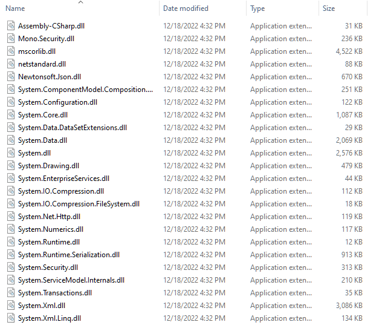

We can launch dnSpy and open ```Assembly-CSharp.dll``` for decompilation and editing. After looking through the various functions and classes for an exploitable method, one promising function I found is the ```OnBallMissed()``` method of the ```GameManager``` class:

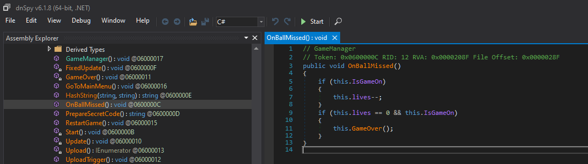

This method decrements the ```lives``` variable whenever a ball is missed by the racket. What if we could edit this method so that our ```points``` variable increased by 1000 every time? This way, by the time we ran out of lives our point score would be well over the 2022 threshold!

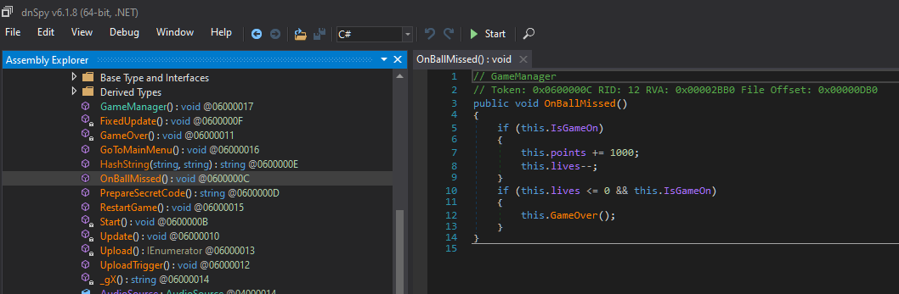

Okay, let's save our changes, recompile ```Assembly-CSharp.dll``` and play the game with our new hacks!!

https://user-images.githubusercontent.com/120992983/208362467-1401fcef-c291-4364-a038-ac98bfed5732.mp4

Wait a second - our score is increasing as expected, yet we didn't get the flag!? And running the game again brings up the following message:

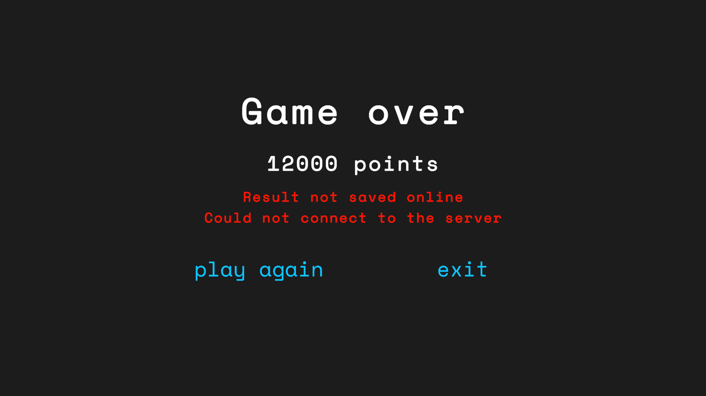

As it turns out, there is an anti-cheat system in place which detects obvious cheating attempts like ours. Whenever it detects blatant cheating, it prohibits our score from reaching the server and refuses to grant the flag. Thus, we need to be more subtle and intelligent about our cheating attempts to bypass the anti-cheat logic.

So what was wrong with the previous approach? By increasing the score by increments of 1000 so rapidly, the anti-cheat engine likely detected the vast disparity between the amount of points gained and the impossibly small amount of balls/time it took to reach that score. A more intelligent approach would be to not touch the score directly, but rather in an indirect way that can bypass the anti-cheat engine. One way to do this is to change the collision logic so that it is impossible for the ball to "miss" the racket!

The inspiration from this idea comes from looking at the ```OnCollisionEnter()``` and ```OnTriggerEnter()``` methods of the ```BallController``` class:

```C#
public void OnCollisionEnter(Collision collision)
{
	if (collision.gameObject.tag == "Racket" && UnityEngine.Object.FindObjectOfType<GameManager>().IsGameOn)
	{
		UnityEngine.Object.FindObjectOfType<GameManager>().points += this.ballId;
		UnityEngine.Object.FindObjectOfType<GameManager>().SoundsManager.PlaySound();
		UnityEngine.Object.FindObjectOfType<GameManager>().ballsHit.Add(this.ballId);
		base.GetComponent<Renderer>().material.DisableKeyword("_EMISSION");

      		//Some stuff I removed for brevity...

		GameObject.FindGameObjectWithTag("Verifier").transform.Translate(0f, (float)num, 0f);
		this.isActive = false;
		if (UnityEngine.Object.FindObjectOfType<GameManager>().UseCameraShake)
		{
			CameraShake.Shake(0.2f, 0.1f);
		}
	}
}

public void OnTriggerEnter(Collider collider)
{
	if (collider.gameObject.tag == "Barrier" && UnityEngine.Object.FindObjectOfType<GameManager>().IsGameOn)
	{
		//Some stuff I removed for brevity...
		
		GameObject.FindGameObjectWithTag("Verifier").transform.Translate((float)num, 0f, 19f);
		UnityEngine.Object.FindObjectOfType<GameManager>().ballsMissed.Add(this.ballId);
		UnityEngine.Object.FindObjectOfType<GameManager>().LifeIndicatorsManager.SetOffRandomIndicator();
		UnityEngine.Object.FindObjectOfType<GameManager>().OnBallMissed();
	}
}
```
Essentially, ```OnCollisionEnter()``` says that if the ball hits the racket, that collision counts as a hit and increases our score. Conversely, ```OnTriggerEnter()``` says that if the ball hits the barrier, that collision counts as a miss and decreases our score. *However*, we can change ```OnTriggerEnter()``` so that any collision the ball makes with the barrier will count as a hit, rather than a miss! This also has the benefit of being more subtle to bypass the anti-cheat engine, because we still need the same amount of balls and time to reach a score of 2022 as the original, authentic version of the game. The improved code is shown below. Notice that until 2022 balls have collided with the barrier, barrier collisions count as successful ball hits. After 2022 balls have been thrown, we know our score is high enough and we can end the game, *subtly*, by reverting barrier collisions back to counting as ball misses.
```C#
public void OnTriggerEnter(Collider collider)
{
	if (collider.gameObject.tag == "Barrier" && UnityEngine.Object.FindObjectOfType<GameManager>().IsGameOn)
	{
		if (UnityEngine.Object.FindObjectOfType<GameManager>().ballsHit.Count < 2022)
		{
			UnityEngine.Object.FindObjectOfType<GameManager>().points += this.ballId;
			UnityEngine.Object.FindObjectOfType<GameManager>().SoundsManager.PlaySound();
			UnityEngine.Object.FindObjectOfType<GameManager>().ballsHit.Add(this.ballId);
			base.GetComponent<Renderer>().material.DisableKeyword("_EMISSION");

			//Some stuff I removed for brevity...

			GameObject.FindGameObjectWithTag("Verifier").transform.Translate(0f, (float)num, 0f);
			this.isActive = false;
			if (UnityEngine.Object.FindObjectOfType<GameManager>().UseCameraShake)
			{
				CameraShake.Shake(0.2f, 0.1f);
				return;
			}
		}
		else
		{
			//Some stuff I removed for brevity...
			
			GameObject.FindGameObjectWithTag("Verifier").transform.Translate((float)num2, 0f, 19f);
			UnityEngine.Object.FindObjectOfType<GameManager>().ballsMissed.Add(this.ballId);
			UnityEngine.Object.FindObjectOfType<GameManager>().LifeIndicatorsManager.SetOffRandomIndicator();
			UnityEngine.Object.FindObjectOfType<GameManager>().OnBallMissed();
		}
	}
}
```
Now, finally, let's save our changes, recompile ```Assembly-CSharp.dll``` and see if our new version works!
(Video sped up and trimmed to fit within the markdown!)

https://user-images.githubusercontent.com/120992983/208371117-0ca4c3f0-7d4c-4914-b264-6a3a07781b90.mp4

**Flag:** ```ping{sdgh4wmh_gg_wp_2022}```

# 8) dialog
In this challenge, we are given a Python program ```app.py``` (included in ```./dialog/app.py```) which implements a simple encryption/decryption scheme. In this scheme, each character in the key/flag is added (encryption) or subtracted (decryption) modulo 256 to/from the corresponding character of the input. The code is shown below:

```Python
import base64
FLAG = open("flag.txt").readline().strip()

class DialogEncryption:
	def __init__(self, key):
		self.key = key
	
	def encrypt(self, message):
		encoded = ""
		for i in range(len(message)):
			key_c = self.key[i % len(self.key)][::-1]
			encoded_c = chr((ord(message[i]) + ord(key_c)) % 256)
			encoded += encoded_c
		return base64.b64encode(encoded.encode()).decode()
	
	def decrypt(self, message):
		decoded = ""
		message = base64.b64decode(message).decode()
		for i in range(len(message)):
			key_c = self.key[i % len(self.key)][::-1]
			decoded_c = chr((256 + ord(message[i]) - ord(key_c)) % 256)
			decoded += decoded_c
		return decoded

key = FLAG
dialog = DialogEncryption(key)
message = "Hi Alice, I'm Bob. I'm sending you a secret message. I hope you can decrypt it."
encrypted = dialog.encrypt(message)
print(encrypted)
```

The challenge authors provide us with a file called ```out.txt``` which contains the ciphertext which was encrypted by this scheme using the flag as the key, and using the same plaintext message shown in the code above. Since we know both the ciphertext and plaintext, it is a trivial matter of brute forcing every possible key char at each step of the decryption to reconstruct the key/flag.

**Python Solution:**
```Python3
import base64

plaintext = "Hi Alice, I'm Bob. I'm sending you a secret message. I hope you can decrypt it."

def decrypt(message):
    flag = ""
    message = base64.b64decode(message).decode()
    for i in range(len(message)):
        for key_char in range(0, 256):
            if plaintext[i] == chr((256 + ord(message[i]) - key_char) % 256):
                flag += chr(key_char)
                break
    print(flag)
    return

f = open("out.txt", "r")
ciphertext = f.readline().rstrip()
decrypt(ciphertext)
```

**Output:**
```
ping{B451c5_0f_3ncrypt10n_t00_345y?-K3y_r3tr13v3d!}ping{B451c5_0f_3ncrypt10n_t0
```

**Flag:** ```ping{B451c5_0f_3ncrypt10n_t00_345y?-K3y_r3tr13v3d!}```

# 9) toss a coin to your witcher
We are given the following conversation between Geralt and Jaskier (characters from the popular game 'The Witcher'):
```
Jaskier: 
- Hey Geralt remember that time...***speaks Elvish***
LSWFWGXYPAELNTWNVPCFJRXMAYMBNPKMFWLYEPRVQLYELSXFVGHERQNICRAHGXRCVAUZCIZDMGEALSMIBRJNOZWZXEJFWUMXNGVKGSGEPGEIAEZDTSWNWQNDUNKITMOUEPMNJCHPTCUFRKLQYRHUCUMFKYCANTRGEVNLDXJXCDNHQEMEHJJOGNTTBKYYTAPYETBMEVTTUMZZCEETMFGHLDLOCGWUCPSEJSEGADSFIAZVIPCIQOHJTJKHXRPEWVRPRXFEWLDLDHEHEWPOWOHFL
ZZDFEMSCLONYGEIJPCNLIOKEPJJGZFREVMKFWUSHNBLAKMLLSFRVKWSPHICKMFSESGSTIBOLIGFDIUGNXRMEZRGYLDWODLBYOTGTBXVOAYYMIAVLQXJEPFJVKZVNHAIKMPDTOZTYJIAJTXDDYLKPQIOVPKYKUDAIHJIAYWDYFIKVKSDYICUKQWPWTPQKAAZIKPPISUKVENSIUPKUDXRBRBVOCNAXGRGAZTTTTVAVOPMMTW
LKAMAMRDLAGNLMBFVWHNTEWOCVFKCEEZDIRLZPSVOJIAGSDPXFEJNNLFKITELNILTYBVIBWNEULTJAKXRODJRTKAHSBNVZURBPSEJSEBJAEKEHKMFOIPDFWJBKUHXMNRBTODPQDXZGRPTXDGVYWODTOIEIFAKMXWPIZCXETAFBGXYANHPGVBVILSPPXYHQNHLOVVVKEDARSEZWYVULICXQTVHHQOSWRAZNNGEFWTNCAINMJMWREMOIRTNIZFUOGYBAMLRJJJBKMPVUTMKHNOIFECKMTOOFASGFGPPNNESVTKMLTQBWLGHVCDESVVVSCEXZQIKASAMIDELKFPRFFHZGGUOPNCFBGXOFGMPPUAPNZSIPTGRZUEFEEPDVMWOLESGZELMJRETILS
HAIVIUIMETJRULKVNXRSZVKXRSAXMEWKDEQCJJMJODUYNIIUNLADFPJBOOECQSXRBJAYTNSWCNPTLXFHGKKWRBEIPTGNHAUUIUZAAEBTWVZCBPWAPHVWHPTMLTYMTMZNFSEJMAKUGRTJMTFPDMTQIIWYTBCJCITMZLXFGKBJNIMEKVZADSIZHEJBJKUEGTEKGCPEYTEJDILAGTBVZTINOGMHGNPHGXOAUJGQTNTBHSHUUOBSNKIDVPFDPRKPDVLXGXMMPLCIZHMEZOVSHCXRJ
NOQEXJGZMUZUIPAZMFWCSQQXVFXLRLUHGQESZNRBVYBIAWHARLBGXPSEQIIYAJTEYRFDGBPDMTEEXTHMBNTJWTORUXBVFYULALTDEQURPDRSMVGZZHBPGVUCBVANMCEHSPNWOLRLOSCEYBXKXNWRTIHVGQEMEPXLVGYLDXLXMMTOOYQTTFKPZMXNOVINYFSXZEIKWUGBNVWZCXVNQTWVLPPMTBAVIUXLYMOCRKPPCEETEIDVPDYVWZVWSSAYCVAUIPTEJBKXAUYXTQCCURPSQOXZKAPTLTWVLKNQISVVVPKUDXRDWN

Geralt: 😳😳😳
- How the hell can you speak Elivsh?!

Jaskier: 😨
- Don't know. That was a crazy **COINCIEDENCE**! I will write a ballade about it!

Geralt: 😕
- Hmmmmm....if only I could remember the key....
```
It's rather clear that this is a cipher of some sort, and after plugging this into [Dcode's cipher identifier](https://www.dcode.fr/cipher-identifier) it seems likely that it is a Vigenere Cipher:

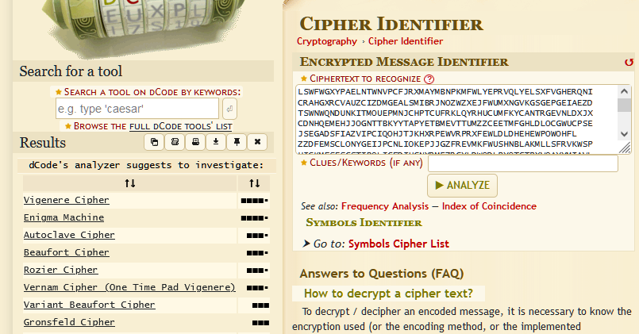

Even though we don't know the key, there are known methods of breaking the Vigenere Cipher, such as [Kasiski Analysis](https://en.wikipedia.org/wiki/Kasiski_examination). Kasiski Analysis takes advantage of the fact that in a Vigenere Cipher the key is repeated, and thus repeated string subsequences in the plaintext are likely to be repeated as well in the ciphertext (assuming the length of the key is relatively small in comparison to the length of the plaintext). By finding many instances of repeated *n*-graphs in the ciphertext we can work backwards to deduce the key length and subsequently break the cipher with frequency analysis.

Luckily for us, there are [free online tools](https://crypto.interactive-maths.com/kasiski-analysis-breaking-the-code.html) available that can do all this work for us! :D

The Crypto Corner tool linked above can automatically find repeated sequences and deduce the most probable key length. Inputing the ciphertext into the tool yields the following results:

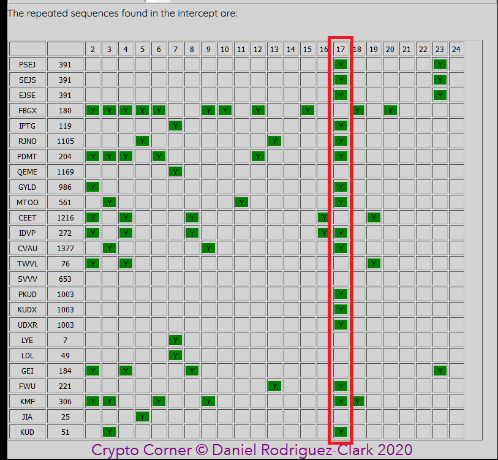

By far the most repeated *n*-graphs occurred at multiples of 17 characters apart, so this is most likely our key length. We can use the [Dcode Vigenere Cipher decoder](https://www.dcode.fr/vigenere-cipher) with a known key length of 17 to decrypt the message:

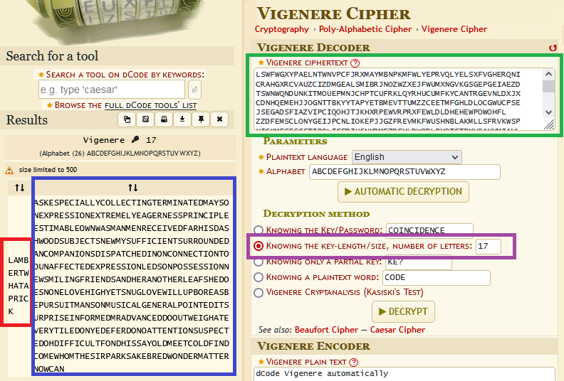

The decrypted plaintext and the key are output on the left! The plaintext is fairly non-sensical, and it turns out the key is the flag we are looking for (remember to add your underscores!).

**Flag:** ```ping{LAMBERT_WHAT_A_PRICK}```

# 10) kind (1/3)
We are given the following image, which displays a strange cipher with certain parts blotted out:

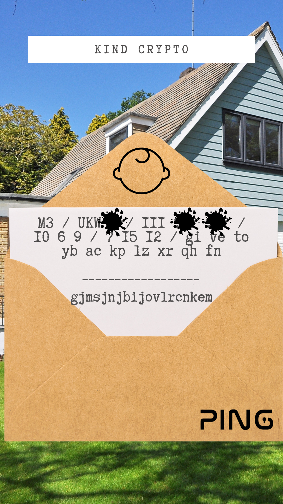

Probably the hardest part of this challenge is figuring out what type of cipher it is, because although it is a unique one, it is rather uncommon. It turns out that this is the famous [Enigma Cipher](https://en.wikipedia.org/wiki/Enigma_machine) which the Germans invented in World War 2 that was eventually broken by the Polish, French, and British. The most obvious giveaway in the image that this is an Enigma Machine is the ```M3``` and ```UKW``` which denote the type of Enigma machine and the type of reflector used, respectively.

If you're unfamiliar with how Enigma Machines operate, I highly recommend the resources found [here](https://www.codesandciphers.org.uk/enigma/) and [here](http://kerryb.github.io/enigma/). They are, at their core, very sophisticated substitution ciphers layered on top of one another and are very good to know about if you're interested in cryptography.

The image gives us the following information:
- The type of Enigma Machine: ```(M3)```
- The configuration of the first rotor: ```(III)```
- The ring positions: ```(10 6 9)```
- The rotor positions: ```(7 15 12) --> (G O L)```
- The plugboard configurations: ```(GI VE TO YB AC KP LZ XR QH FN)```
- The ciphertext: ```gjmsjnjbijovlrcnkem```

The image leaves out the following information:
- The type of reflector: ```(UKW-B or UKW-C)```
- The configuration of the second and third rotors: ```(I-VIII) (I-VIII)```

Thus, it's clear that our goal is to brute force the missing information to determine the exact Enigma Machine configuration that decodes the ciphertext into a coherent plaintext. To automate this process, I use the [aenig4](https://jorgicor.niobe.org/aenig4/) command line utility to easily emulate the Enigma Machine logic. This command line utility takes as its command line arguments the parameters discussed above (rotor configuration, ring and rotor starting positions, plugboard configurations, etc.) and outputs the decoded plaintext. Using this tool, I wrote a Python script to efficiently brute force the flag.

Let's do a little complexity analysis before we begin - how many combinations will we have to go through? We are brute forcing the reflector with 2 possibilities and 2 rotors with 8 possible configurations each --> ```2*8*8 = 128``` combinations. Not too bad, eh?

**Python Solution:**
```Python
import subprocess

reflectors = ['b', 'c']
rotors = ['I', 'II', 'III', 'IV', 'V', 'VI', 'VII', 'VIII']

f = open('out.txt', 'w')
t = None

for ref in reflectors:
    for rot2 in rotors:
        for rot3 in rotors:

            #Aenig4 does not allow repeated rotors
            if rot2 == rot3:
                continue

            if ref == 'b':
                t = 'Beta'
            else:
                t = 'Gamma'

            #For the given reflector/rotor/ring configuration, attempt to decode the ciphertext
            #in source.txt using the M3 Enigma machine
            command = 'aenig4 -k \"' + ref + ' ' + t + ' III ' + rot2 + ' ' + rot3 + ' 1 10 6 9 '
            command = command + 'AGOL GI VE TO YB AC KP LZ XR QH FN\" source.txt dest.txt'
            output = subprocess.getoutput(command)

            #Now read the output from 'dest.txt' and write it to the culmulative output file
            f2 = open('dest.txt', 'r')
            decrypted = f2.readline()
            f.write(decrypted)
            f2.close()

            if(decrypted[0:4] == 'ping'):
                print('--> Potential Answer: ' + decrypted)

f.close()
```

**Output:** ```--> Potential Answer: pingcanyoufindmydad```

**Flag:** ```ping{can_you_find_my_dad}```

# 11) vater (2/3)
We are given another Enigma Machine with certain parameters blotted out:

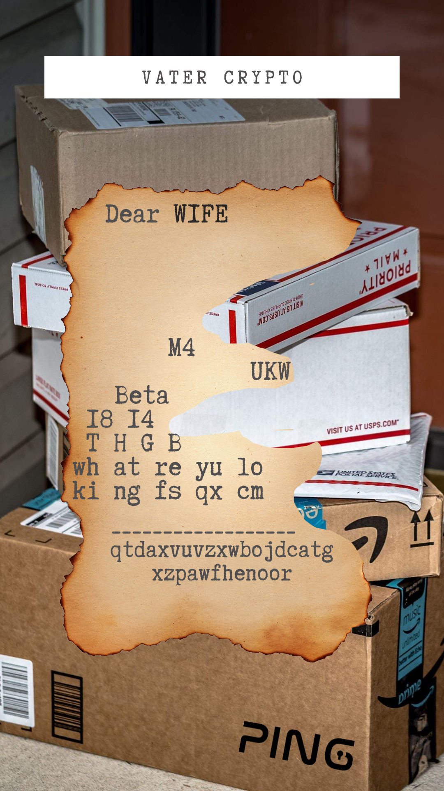

The image gives us the following information:
- The type of Enigma Machine: ```(M4)```
- The configuration of the first rotor: ```(Beta)```
- The first two ring positions: ```(18 14)```
- The rotor positions: ```(T H G B)```
- The plugboard configurations: ```(WH AT RE YU LO KI NG FS QX CM)```
- The ciphertext: ```qtdaxvuvzxwbojdcatgxzpawfhenoor```

The image leaves out the following information:
- The type of reflector: ```(UKW-B or UKW-C)```
- The configuration of the second, third, and fourth rotors: ```(I-VIII) (I-VIII) (I-VIII)```
- The third and fourth ring positions: ```(1-26) (1-26)```

This time, the complexity of the problem has increased. Instead of using an M3 machine (which only has 3 rotors) we are now using an M4 machine (which has 4 - the extra rotor is called Beta/Gamma, depending on which one is chosen). Additionally, more information is missing this time, 3 rotor configurations and 2 ring positions. This means that there are more possible combinations of configurations possible and thus our brute force approach might take longer. 

Let's once again do some complexity analysis. We are brute forcing the reflector which has 2 possibilities, 3 rotor configurations with 8 possibilities each, and 2 ring positions with 26 possibilities each --> ```2*8*8*8*26*26 = 692224``` combinations. This is quite a bit more than previous, no? (Note that this is an upper limit, since technically rotors can not be repeated, e.g. III III III is not allowed, nor I I III, but I II III is allowed. This is just an approximation for us to eyeball our performance).

**Python Solution:**
```Python
import subprocess

reflectors = ['b', 'c']
rotors = ['I', 'II', 'III', 'IV', 'V', 'VI', 'VII', 'VIII']
rings = ['1', '2', '3', '4', '5', '6', '7', '8', '9', '10', '11', '12', '13', '14', '15', '16', '17', '18', '19', '20', '21', '22', '23', '24', '25', '26']

f = open('out.txt', 'w')

num_combinations = len(reflectors) * len(rotors)**3 * len(rings)**2
print("Total number of combinations: " + str(num_combinations) + '\n')

count = 0

for ref in reflectors:
    for rot1 in rotors:
        for rot2 in rotors:

            #Aenig4 does not allow repeated rotors
            if rot2 == rot1:
                continue

            for rot3 in rotors:
            
                #Aenig4 does not allow repeated rotors
                if rot3 == rot1 or rot3 == rot2:
                    continue
                
                for ring3 in rings:
                    for ring4 in rings:
                        
                        count += 1
                        if count % 100000 == 0:
                            print("--> " + str(count) + " messages decoded...")

                        #For the given reflector/rotor/ring configuration, attempt to decode the ciphertext
                        #in source.txt using the M4 Enigma machine
                        command = 'aenig4 -k \"' + ref + ' Beta ' + rot1 + ' ' + rot2 + ' ' + rot3 + ' 18 14 '
                        command = command + ring3 + ' ' + ring4 + ' THGB WH AT RE YU LO KI NG FS QX CM\" source.txt dest.txt'
                        output = subprocess.getoutput(command)

                        #Now read the output from 'dest.txt' and write it to the culmulative output file
                        f2 = open('dest.txt', 'r')
                        decrypted = f2.readline()
                        f.write(decrypted)
                        f2.close()

                        if decrypted[0:4] == "ping":
                            print('--> Potential Answer: ' + decrypted)
f.close()
```

**Output:**
```
Total number of combinations: 692224
--> Potential Answer: pingqqwsjhhercobozcrwvsghwvzrsf
--> 100000 messages decoded...
--> 200000 messages decoded...
--> 300000 messages decoded...
--> Potential Answer: pingitwasmyvaderwhokilledmywife
...
```
As you can see, as we start brute forcing large numbers of combinations, we'll start getting some "false positives", i.e. some outputs which start with ```ping``` but aren't actually the plaintext. This is simply due to randomness and probability, so we have to sift through the outputs to find the correct flag, which we can easily see is ```pingitwasmyvaderwhokilledmywife```.

**Flag:** ```ping{it_was_my_vader_who_killed_my_wife}```

# 12) opa (3/3)
We are, yet again, given an Enigma Machine with certain parameters blotted out:

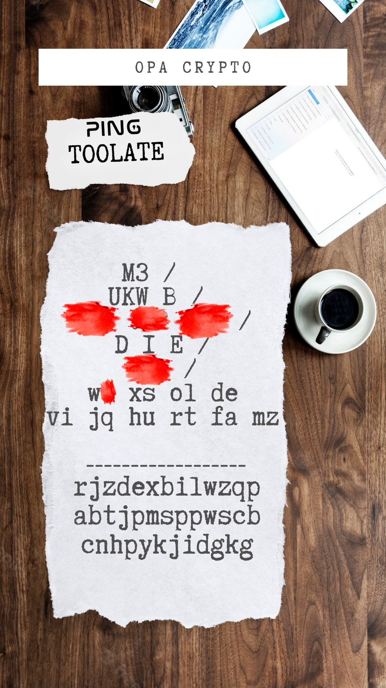

The image gives us the following information:
- The type of Enigma Machine: ```(M3)```
- The type of reflector: ```(UKW-B)```
- The ring positions: ```(D I E)```
- The plugboard configurations, except for one letter: ```(W? XS OL DE VI JQ HU RT FA MZ)```
- The ciphertext: ```rjzdexbilwzqpabtjpmsppwscbcnhpykjidgkg```

The image leaves out the following information:
- The rotor configurations: ```(I-VIII) (I-VIII) (I-VIII)```
- The rotor starting positions: ```(A-Z) (A-Z) (A-Z)```
- The missing plugboard letter: ```is one of (b, c, g, k, n, p, y)```

We are once again using an M3 machine, but even more information is missing, so our complexity is increased once again. This time, we are brute forcing 3 rotor configurations with 8 possibilities each, 3 rotor starting positions with 26 possibilities each, and one plugboard letter with 7 possibilities --> ```8*8*8*26*26*26*7 = 62992384``` combinations. Again, this is an upper limit, but ~63 million combinations will take quite a bit longer to brute force than the ~700,000 combinations in the previous challenge.

**Python Solution:**
```Python
import subprocess

rotors = ['I', 'II', 'III', 'IV', 'V', 'VI', 'VII', 'VIII']
rotor_positions = ['A', 'B', 'C', 'D', 'E', 'F', 'G', 'H', 'I', 'J', 'K', 'L', 'M', 'N', 'O', 'P', 'Q', 'R', 'S', 'T', 'U', 'V', 'W', 'X', 'Y', 'Z']
letters = ['b', 'c', 'g', 'k', 'n', 'p', 'y']

f = open('out.txt', 'w')

num_combinations = len(rotors)**3 * len(rotor_positions)**3 * len(letters)
print("Total number of combinations: " + str(num_combinations) + '\n')

count = 0

for rot1 in rotors:
    for rot2 in rotors:

        #Aenig4 does not allow repeated rotors
        if rot2 == rot1:
            continue

        for rot3 in rotors:

            #Aenig4 does not allow repeated rotors
            if rot3 == rot1 or rot3 == rot2:
                continue
                
            for pos1 in rotor_positions:
                for pos2 in rotor_positions:
                    for pos3 in rotor_positions:
                        for letter in letters:

                            count += 1
                            if count % 100000 == 0:
                                print("--> " + str(count) + "/" + str(num_combinations) + " messages decoded (" + str((float(count) / float(num_combinations))*100) + "%)...")

                        #For the given reflector/rotor/ring/plugboard configuration, attempt to decode the ciphertext
                        #in source.txt using the M4 Enigma machine
                        command = 'aenig4 -k \"b Beta ' + rot1 + ' ' + rot2 + ' ' + rot3 + ' 1 4 9 5 A' + pos1 + pos2 + pos3
                        command = command + ' W' + letter + ' XS OL DE VI JQ HU RT FA MZ\" source.txt dest.txt'
                        output = subprocess.getoutput(command)

                        #Now read the output from 'dest.txt' and write it to the culmulative output file
                        f2 = open('dest.txt', 'r')
                        decrypted = f2.readline()
                        if decrypted[0:4] == "ping":
                            f.write(decrypted)
                            print('--> Potential Answer: ' + decrypted)
                        f2.close()
f.close()
```

After about 15 minutes running on my machine, I luckily found the flag after only ~10% of the possible combinations were computed.

**Output:**

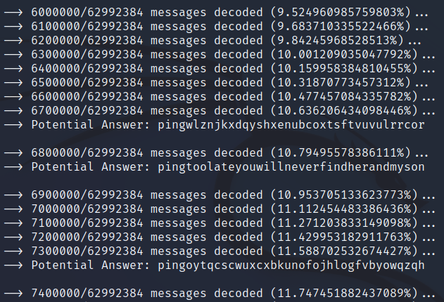

**Flag:** ```ping{too_late_you_will_never_find_her_and_my_son}```

# Conclusion
Thank you to everyone who read until the end! This is my first CTF write-up and I had a blast writing it and solving all these challenges.
This is my first top-3 finish in a CTF and I hope to keep improving my skills.

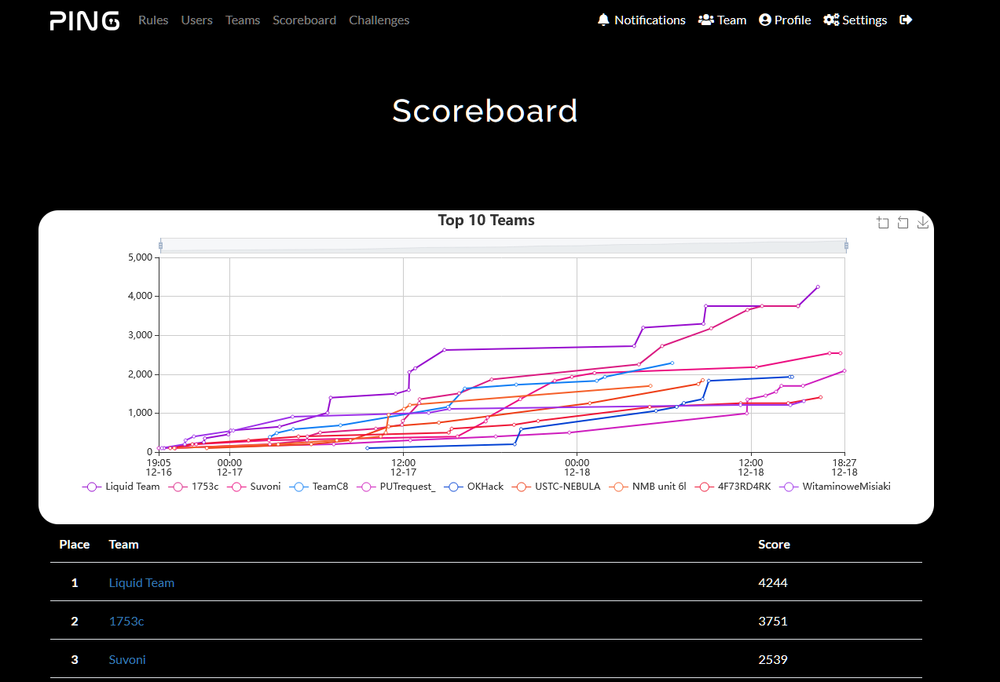

If you have any questions or want to team up in the future, my contact is suvoni.ctf@gmail.com

Until next time...
