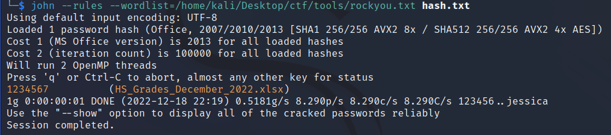
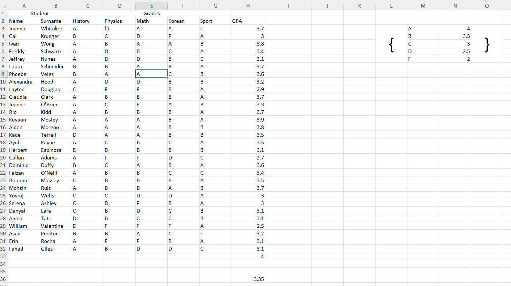
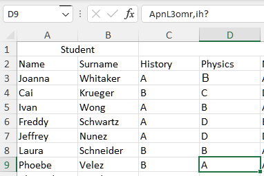
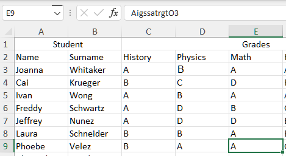
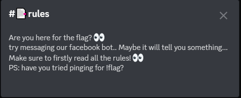
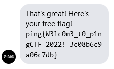

# pingCTF 2022 Writeup (3rd Place)
Competition URL: https://ctf.knping.pl/
## Overview

| Challenge | Category | Flag |
| --------- | -------- | ---- |
| baby rev  | Rev | ping{r3v3rs1ng_c4n_b3_S0_muCH_FUN!!!} |
| crypto    | Rev | ping{3n1gm4_fl4sh_b4ck5_d0_y0u_r3c4ll?} |
| high school grades | Misc | ping{sosmart,right?} |
| welcome | Misc | ping{W3lc0m3_t0_p1ngCTF_2022!_3c08b6c9a06c7db} |
| guess what | Misc | ping{F28ied9a4n} |

## 1) Baby Rev
In this simple reverse engineering challenge, we are given an ELF64 executable named ```babyrev``` to analyze. Opening it up in Ghidra or IDA, we can easily find a red herring function named ```checkflag``` and decompile it:
```C
__int64 __fastcall checkflag(_BYTE *a1)
{
  int i; // [rsp+18h] [rbp-38h]
  int j; // [rsp+1Ch] [rbp-34h]
  char v5[40]; // [rsp+20h] [rbp-30h]
  unsigned __int64 v6; // [rsp+48h] [rbp-8h]

  v6 = __readfsqword(0x28u);
  if ( *a1 != 112 || a1[1] != 105 || a1[2] != 110 || a1[3] != 103 || a1[4] != 123 || a1[37] != 125 )
    return 0LL;
  for ( i = 0; i <= 31; ++i )
    v5[i] = a1[i + 5];
  for ( j = 0; j <= 152; ++j )
  {
    if ( 4 * (v5[j % 31] ^ KEYS[j % 14]) + 2 * j != FLAG[j] )
      return 0LL;
  }
  return 1LL;
}
  ```

where ```a1``` is the user input into the program, i.e., the flag which function ```checkflag``` is actually checking.
```checkflag``` takes the contents of the input string within ping{...} and checks whether each char satisfies the following equation:

```if ( 4 * (v5[j % 31] ^ KEYS[j % 14]) + 2 * j != FLAG[j] )```

where v5 is a char array holding the contents of the flag and KEYS and FLAG are integer arrays which we can find within the memory region in Ghidra/IDA.
Once we have the arrays FLAG and KEYS, can simply rearrange the equation to solve for the flag characters and reconstruct the flag.

**Python Solution:**
```Python
KEYS = ['1', '3', '3', '7', '50', '49', '4E', '47', '20', '52', '4F', '43', '4B', '53', '0', '0']
FLAG = ['1CC', '0C2', '1D8', '0D6', '90', '0F2', '208', '0B2', '12C', '46', '0C4', '1F2', '0AC', '4A', '1A8', '0DE', '190', '172', '1A4', '7E', '0B4', '0F2', '1B8', '96',
'70', '46', '0AC', '0AA', '0B8', '0C2', '0C4', '212', '1CC', '13E', '238', '11A', '194', '1D6', '0D0', '0DE', '0A0', '112', '128', '20A', '1C8', '1EE', '1E8', '0B6', '0D4',
'23E', '260', '162', '150', '6A', '78', '9E', '18C', '1CA', '1A8', '10E', '23C', '21A', '16C', '24E', '1D8', '206', '178', '146', '270', '17E', '224', '1FE', '210', '15E',
'18C', '0EE', '148', '26A', '298', '0A2', '29C', '112', '13C', '13E', '1B0', '1D6', '21C', '1B2', '0C4', '0CE', '270', '24E', '0BC', '13A', '2AC', '192', '2A0', '146', '28C',
'18E', '27C', '24A', '108', '176', '2B8', '176', '2D0', '196', '2C8', '14A', '13C', '26A', '258', '29A', '2BC', '1F6', '148', '142', '10C', '136', '2A8', '2BE', '2AC', '27E',
'1DC', '27A', '2D8', '1BE', '2C4', '2D2', '288', '1A2', '1AC', '16A', '218', '2A6', '194', '182', '1B8', '296', '290', '25A', '1E8', '27E', '214', '212', '158', '162', '324',
'17A', '194', '162', '2D8']

s = ""
for i in range(0, 153):
    flag_int = int(FLAG[i], 16)
    key_int = int(KEYS[i%14], 16)
    c = int(((flag_int - (i*2)) / 4)) ^ key_int
    print(chr(c), end="")
```

**Output:** ```r3v3rs1ng_c4n_b3_S0_muCH_FUN!!!r3v3rs1ng_c4n_b3_S0_muCH_FUN!!!r3v3rs1ng_c4n_b3_S0_muCH_FUN!!!r3v3rs1ng_c4n_b3_S0_muCH_FUN!!!r3v3rs1ng_c4n_b3_S0_muCH_FUN!```

**Flag**: ```ping{r3v3rs1ng_c4n_b3_S0_muCH_FUN!!!}```

## 2) crypto
In this challenge, we are given a Python script called ```app.py``` which implements a cryptographic encryption scheme. We are also given the plaintext and ciphertext for this scheme, but not the key, which is the flag. Thus, our goal is to reverse engineer the key using the code and given plaintext/ciphertext.

The fundamental mechanism behind the cipher's operation is the substitution of characters in the plaintext with characters from an array of printable characters (the "alphabet") which is circularly shifted and XOR'ed with the flag/key at various points in the encryption process. Since we have the code and the ciphertext/plaintext at our disposal, it is rather trivial to reverse the process by brute forcing each flag character whenever the alphabet is being changed (see the ```move``` function in the code below for more detail). 

**Python Solution:**
```Python
from binascii import hexlify, unhexlify

printable = [chr(i) for i in range(0, 0xff)]

encrypted = None

class Flawless:
    rounds = []
    def __init__(self, *rs):
        self.alphabet = printable
        #self.rounds[:0] = rs[0]
        self.l = 11
        #self.l = len(rs[0])

    def move(self, c, j):
        current_ciphertext_int = ord(encrypted[j])
        current_plaintext_int = ord(c)

        alph_byte = ord(self.alphabet[current_plaintext_int])
        flag_byte = None
        for flag_temp in range(0, 256):
            if (flag_temp ^ alph_byte) % 255 == current_ciphertext_int:
                flag_byte = flag_temp
                print(chr(flag_byte), end="")
                break

        for i in range(len(self.alphabet)):
            self.alphabet[i] = chr((flag_byte ^ ord(self.alphabet[i])) % 0xff)
        self.current += 1

    def move_left(self):
        first = self.alphabet[0]
        self.alphabet = self.alphabet[1:]
        self.alphabet.append(first)

    def move_right(self):
        last = self.alphabet[-1]
        self.alphabet = self.alphabet[:-1]
        self.alphabet.insert(0, last)

    def press(self, c, j):
        if self.P > 0 and self.I > 0 and self.N > 0 and self.G > 0:
            self.move_left()
            self.reset_ping()
        elif ord(c) % 4 == 0:
            self.move(c, j)
        elif ord(c) % 5 == 0:
            self.move_right()
        i = printable.index(c)
        return self.alphabet[i]

    def encipher(self, text):
        self.current = 0
        self.reset_ping()
        ciphertext = ""
        j = -1
        for c in text:
            j += 1
            if c.upper() == 'P':
                self.P += 1
            elif c.upper() == 'I':
                self.I += 1
            elif c.upper() == 'N':
                self.N += 1
            elif c.upper() == 'G':
                self.G += 1
            ciphertext += self.press(c, j)
        return hexlify(ciphertext.encode()).decode()

    def reset_ping(self):
        self.P = 0
        self.I = 0
        self.N = 0
        self.G = 0

#Solution
f = open('out.txt', 'r')
encrypted = f.readline().rstrip()
encrypted = unhexlify(encrypted.encode()).decode()

very_secret_cipher_text = "Nunc at lorem mauris. Cras eu egestas diam. Sed tincidunt augue sit amet mauris accumsan bibendum. Aliquam eget dapibus massa, vitae dictum lectus. Aliquam volutpat, metus sit amet efficitur pellentesque, ipsum nibh gravida elit, non gravida magna quam vel nulla. Maecenas vestibulum ultrices lectus, eu sodales magna blandit nec. Proin sit amet urna viverra, aliquet enim vel, eleifend sapien. Sed placerat efficitur ipsum ac rhoncus. Phasellus tempor rhoncus mollis. Phasellus dapibus ultricies aliquam. Vestibulum tempor nulla quis dictum tristique. Quisque luctus ligula ac feugiat commodo. Morbi commodo viverra nunc. Morbi faucibus arcu nisl, in scelerisque lorem vulputate id. Nulla iaculis sagittis ipsum, aliquet placerat lorem cursus ac. Fusce faucibus sapien a vestibulum finibus. Nunc commodo ullamcorper nunc, ac ullamcorper orci mattis sit amet. In faucibus enim eu pellentesque congue. Interdum et malesuada fames ac ante ipsum primis in faucibus. Curabitur malesuada dui lorem. Nunc varius velit in tellus gravida, mollis porttitor dolor tristique. Interdum et malesuada fames ac ante ipsum primis in faucibus. Aliquam libero felis, ullamcorper non est nec, malesuada ultrices odio. Donec sagittis efficitur diam, non gravida lorem. Fusce bibendum mi ut libero malesuada, eu laoreet tellus dictum. Vivamus sollicitudin sed neque at rutrum. Curabitur tempus rhoncus quam eu efficitur. Aliquam maximus magna augue, at lacinia lectus vestibulum sed. Donec semper consectetur lorem. Vestibulum in sodales massa. Aenean vitae ultricies metus, sit amet vestibulum mauris. Integer orci nisi, pulvinar sit amet dui eu, fermentum lobortis nunc. Nulla luctus at lectus ac vestibulum. Nulla at ipsum tristique, tristique est eget, pharetra lectus. Morbi urna lacus."
generator = Flawless()
enciphered = generator.encipher(very_secret_cipher_text)
```

**Output:** ```ping{3n1gm4_fl4sh_b4ck5_d0_y0u_r3c4ll?}ping{3n1gm4_fl4sh_b4ck5_d0_y0u_r3c4ll?}ping{3n1gm4_fl4sh_b4ck5_d0_y0u_r3c4ll?}ping{3n1gm4_fl4sh_b4ck5_d0_y0u_r3c4ll?}ping{3n1gm4_fl4sh_b4ck5_d0_y0u_r3c4ll?}ping{3n1gm4_fl4sh_b4ck5_d0_y0u_r3c4ll?}ping{3n1gm4_fl4sh_b4ck5_d0_y0u_r3c4ll?}ping{3n1gm4_fl4sh_b4ck5_d0_y0u_r3c4ll?}ping{3n1gm4_fl4sh_b4ck5_d0_y0u_r3c4ll?}ping{3n1gm4_fl4sh_b4ck5_d0_y0u_r3c4ll?}ping{3n1gm4_fl4sh_b4ck5_d0_y0u_r3c4ll?}ping{3n1gm4_fl4sh_b4ck5_d0_y0u_r3c4ll?}ping{3n1gm4_fl4sh_b4ck5_d0_y0u_r3c4ll?}ping{3n1gm4_fl4sh_b4ck5_d0_y0u_r3c4ll?}ping{```

**Flag:** ```ping{3n1gm4_fl4sh_b4ck5_d0_y0u_r3c4ll?}```

## 3) high school grades
We are given a password-protected Excel spreadsheet with students' grades on it. A clue given to us is that the teacher isn't very creative with their password, indicating that the password is very weak (and hence, easily crackable by brute force!). Knowing this, John the Ripper can be used to crack the password easily. To do this, I first had to generate the password hash that John needs to operate properly. Since the Excel file is a Microsoft Office file, the ```office2john.py``` utility is needed for this. The full command to generate the hash file is:

```/usr/share/john/office2john.py HS_Grades_December_2022.xlsx > hash.txt```

Then, to crack the password with John, a wordlist is needed for brute force password generation. I used the classic ```rockyou.txt``` wordlist which can be found easily on the internet. Once that was downloaded, cracking the password was as easy as running a simple command:



Bingo! The password is thus ```1234567```. Unlocking the Excel file, we see the following data:



These are the student grades that the challenge description told us about. At first glance, there really isn't anything suspicious going on here. However, after doing a lot of close searching, we discover that there is hidden data within 2 cells:





It looks like Phoebe Velez is our culprit! The hidden data in the two cells is ```ApnL3omr,ih?``` and ```AigssatrgtO3```. Looking very closely, you can see that our flag is hidden between these strings. By removing the leading 'A's (which were simply the grades) and alternating letters between the two strings, we can reconstruct the flag. For example, removing the leading 'A's leaves us with ```pnL3omr,ih?``` and ```igssatrgtO3```. Taking the first letters of both strings and putting them together gives us ```pi```. Taking the second two letters and adding them on gives us ```ping```. Continue the sequence (notice that L3 and O3 are the bracket characters in the Excel spreadsheet!) and we end up with the flag: ```ping{sosmart,right?}```

**Flag:** ```ping{sosmart,right?}```

## 4) welcome
The following clue is available on the rules page of the pingCTF Discord server:



Going to the pingCTF Facebook page and messaging ```!flag``` to the bot will cause the bot to ask you if you liked the pingCTF fanpage and Twitter. After saying yes to both questions, the bot will grant you the flag:



**Flag:** ```ping{W3lc0m3_t0_p1ngCTF_2022!_3c08b6c9a06c7db}```

## 5) guess what
This challenge provides a Python program that asks the user to correctly "guess" various strings and numbers that the program randomly generates. We are given the source code, and a quick investigation reveals that mere guessing will not be sufficient to get the flag - we have to automate a solution.

There are 4 separate guessing tests in this challenge. The first guessing test (see the provided file ./guesswhat/src/pow.py) generates a SHA256 hash of a randomly-generated 20-byte number. The first 17 bytes of the number are given to us as well as the full hash. Our task is to "guess" the other 3 bytes of the number to continue to the next test. Obviously, the odds of guessing a 3-byte value correctly are stacked against us (it is a 1 in 2^24 = 16777216 chance!). So, we can write code to brute force this 3-byte value and submit it to the program to continue.

The second and third guessing tests (see ./guesswhat/src/part1.py and ./guesswhat/src/part2.py) involve guessing string permutations of a given length from the provided character set (defined in ./guesswhat/src/common.py). The second test generates random strings of increasing lengths (starting at 2 and ending at 18) from the alphabet ['A', 'B']. The program generates all possible permutations (2^length total permutations) and prints out all but one of them to the console; our task is to figure out which one is missing. This can be easily brute-forced by finding all possible permutations and seeing which one is missing. The third guessing test is very similar to the second, except the character alphabet is now ['A', 'B', 'C', 'D'], meaning that the number of permutations increases for the same string length (4^length total permutations). Oh, and did I mention there is now a time limit? ;)

Finally, the last guessing test (see ./guesswhat/src/part3.py) is the hardest. The program reads the contents of the flag (i.e., the flag contents in between the brackets of ping{...}) and generates all permutations of the flag. Like the previous tests, it prints all permutations except the *real* flag, and we have 15 seconds to find the correct one. Luckily, the time limit doesn't really matter, since exceeding it doesn't prohibit us from getting the flag. After connecting to the challenge server and seeing the printed permutations, we find out that there are 10 characters in the flag: **F28ied9a4n**. That means we have 10! = 3628800 permutations to generate and must find the missing one - a true needle in the haystack!

Okay, enough chatter. The solution code is:
```Python
import pexpect
from src.common import *
import hashlib
import time
import secrets

flag_chars = "F28ied9a4n"
flags = ["".join(x) for x in itertools.permutations(flag_chars)]
print("Number of flags = " + str(len(flags)) + "\n")

print("--> Running Exploit Script for pingCTF Challenge \"Guess What\"...")

con = pexpect.spawn('nc guess_what.ctf.knping.pl 20000', timeout=30)
response = con.expect( ["sha256", pexpect.TIMEOUT, pexpect.EOF] )
if response == 1:
    print("----> Exploit Result: Failure (Netcat connection timed out)")
    exit()
elif response == 2:
    print("----> Exploit Result: Failure (Netcat response different than expected response)")
    exit()

line0 = con.readline().decode()

#For the initial test
rest = None
prefix = line0[2:36]
c = line0[52:116]

print("\nFinding the 3-byte secret value 'rest'...\n")

for i in range(0, 16777216):
    rest = "{:06x}".format(i)
    if hashlib.sha256((prefix + rest).encode()).hexdigest() == c:
        print("--> Sending: " + rest + "\n")
        break

con.sendline(rest)
response = con.expect(["Hi, this is my game", pexpect.TIMEOUT, pexpect.EOF])
if response == 1:
    print("----> Exploit Result: Failure (Netcat connection timed out)")
    exit()
elif response == 2:
    print("----> Exploit Result: Failure (Netcat response different than expected response)")
    exit()

line = con.readline().decode()
print(line, end="")
line = con.readline().decode()
print(line, end="")
line = con.readline().decode()
print(line, end="")

#Part 1 begins now
con.sendline()

for i in range(2, 18):
 
    strings = ["".join(x) for x in itertools.product(intro_dictionary, repeat=i)]
    print("Iteration " + str(i) + ":")

    response = con.expect(["PRINTING...", pexpect.TIMEOUT, pexpect.EOF])
    if response == 1:
        print("----> Exploit Result: Failure (Netcat connection timed out)")
        exit()
    elif response == 2:
        print("----> Exploit Result: Failure (Netcat response different than expected response)")
        exit()

    line = con.readline().decode()

    num_reads = 2**i - 1
    remaining_strings = []
    for j in range(0, num_reads):
        line = con.readline().decode()[0:i]
        strings.remove(line)
   
    line = con.readline().decode()
    line = con.readline().decode()

    print("--> Sending: " + strings[0] + "\n")
    con.sendline(strings[0])
   
line = con.readline().decode()
print(line, end="")
line = con.readline().decode()
print(line, end="")
line = con.readline().decode()
print(line, end="")
line = con.readline().decode()
print(line, end="")
line = con.readline().decode()
print(line, end="")
line = con.readline().decode()
print(line)

#Part 2 begins here
con.sendline()
for i in range(2, 6):
 
    strings = ["".join(x) for x in itertools.product(mid_dictionary, repeat=6)]
    print("Iteration " + str(i) + ":")

    response = con.expect(["PRINTING...", pexpect.TIMEOUT, pexpect.EOF])
    if response == 1:
        print("----> Exploit Result: Failure (Netcat connection timed out)")
        exit()
    elif response == 2:
        print("----> Exploit Result: Failure (Netcat response different than expected response)")
        exit()

    line = con.readline().decode()

    num_reads = 4**6 - 1
    remaining_strings = []
    for j in range(0, num_reads):
        line = con.readline().decode()
        strings.remove(line[0:6])
   
    line = con.readline().decode()
    line = con.readline().decode()

    print("--> Sending: " + strings[0] + "\n")
    con.sendline(strings[0])
   
#Part 3!!
line = con.readline().decode()
print("Line 1: " + line, end="")
line = con.readline().decode()
print("Line 2: " + line, end="")
line = con.readline().decode()
print("Line 3: " + line, end="")

con.sendline()

response = con.expect(["PRINTING...", pexpect.TIMEOUT, pexpect.EOF])
if response == 1:
    print("----> Exploit Result: Failure (Netcat connection timed out)")
    exit()
elif response == 2:
    print("----> Exploit Result: Failure (Netcat response different than expected response)")
    exit()

flags2 = []
line = con.readline().decode().rstrip()
i = 1
while "DONE PRINTING" not in line:
    #if line in flags:
    print(i)
    flags2.append(line)
    #flags.remove(line)
    #else:
    #    print("Could not find " + line + " in flags.")
    #    print("line length = " + str(len(line)))
    line = con.readline().decode().rstrip()
    i += 1
print("--> Finished with the processing!")
print("--> Final flags list size: " + str(len(flags)))
print("--> Final flags2 list size: " + str(len(flags2)))
f = list(set(flags) - set(flags2))
print(f)
final_flag = "ping{" + flags[0] + "}"
print("--> Sending: " + final_flag)

line = con.readline().decode()
print(line, end="")
line = con.readline().decode()
print(line, end="")
line = con.readline().decode()
print(line, end="")
line = con.readline().decode()
print(line, end="")
line = con.readline().decode()
print(line)

con.close()

exit()
```

**Note:** After the competition ended I realized that I forgot to write down the flag anywhere, and have no way to find it without the server being online. Thus the flag here isn't the correct one, but rather it is a permutation of the correct one - this is as close as I can provide at this point.

**Flag:** ```ping{F28ied9a4n}```
